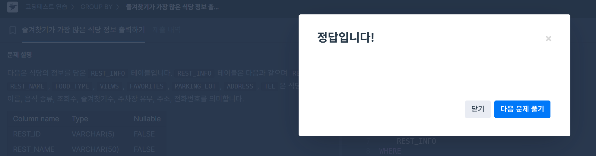

# Week1

# SQL_ADVANCED 1주차 정규 과제

## Week 1 : 서브쿼리 & CTE

📌**SQL_ADVANCED 정규과제**는 매주 정해진 주제에 따라 **MySQL 공식 문서 또는 한글 블로그 자료를 참고해 개념을 정리한 후, 프로그래머스 SQL 3문제**와 **추가 확인문제**를 직접 풀어보며 학습하는 과제입니다.

이번 주는 아래의 **SQL_ADVANCED_0th_TIL**에 나열된 주제를 중심으로 개념을 학습하고, 주차별 **학습 목표**에 맞게 정리해주세요. 정리한 내용은 GitHub에 업로드한 후, **스프레드시트의 ‘SQL’ 시트에 링크를 제출**해주세요.

**👀 (수행 인증샷은 필수입니다.)**

> 프로그래머스 문제를 풀고 ‘정답입니다’ 문구를 캡쳐해서 올려주시면 됩니다.
> 

## SQL_ADVANCED_1st_TIL

### 15.2.15. SubQueries

### 특히 15.2.15.1 ~ 15.2.15.7 (Scalar, EXISTS, Correlated, Derived 등)

### 15.2.20 WITH (Common Table Expressions)

- `WITH RECURSIVE`에 대한 내용은 추후에 공부합니다. 해당 링크에서 `WITH`에 해당하는 부분만 정리해보세요.

## 🏁 주차별 학습 (Study Schedule)

| 주차 | 공부 범위 | 완료 여부 |
| --- | --- | --- |
| 1주차 | 서브쿼리 & CTE | ✅ |
| 2주차 | 집합 연산자 & 그룹 함수 | 🍽️ |
| 3주차 | 윈도우 함수 | 🍽️ |
| 4주차 | Top N 쿼리 | 🍽️ |
| 5주차 | 계층형 질의와 셀프 조인 | 🍽️ |
| 6주차 | PIVOT / UNPIVOT | 🍽️ |
| 7주차 | 정규 표현식 | 🍽️ |

### 공식 문서 활용 팁

> MySQL 공식 문서는 영어로 제공되지만, 크롬 브라우저에서 공식 문서를 열고 이 페이지 번역하기에서 한국어를 선택하면 번역된 버전으로 확인할 수 있습니다. 다만, 번역본은 문맥이 어색한 부분이 종종 있으니 영어 원문과 한국어 번역본을 왔다 갔다 하며 확인하거나, 교육팀장의 정리 예시를 참고하셔도 괜찮습니다.
> 

# 1️⃣ 학습 내용

> 아래의 링크를 통해 MySQL 공식문서로 이동하실 수 있습니다.
> 
> - SubQueries : MySQL 공식문서
> 
> https://dev.mysql.com/doc/refman/8.0/en/subqueries.html
> 
> (한국어 버전)
> https://dart-b-official.github.io/posts/mysql-subqueries/
> 

> CTE(공통 테이블 표현식) : MySQL 공식문서
> 
> 
> https://dev.mysql.com/doc/refman/8.0/en/with.html
> 
> (한국어 버전)
> https://dart-b-official.github.io/posts/mysql-cte/
> 

# 2️⃣ 학습 내용 정리하기

---

### 서브쿼리 (Subqueries)

서브쿼리는 다른 SQL 문 안에 중첩된 `SELECT` 문. 바깥쪽 쿼리(Outer Query)가 서브쿼리의 결과를 사용하여 작업을 수행.

### **서브쿼리의 주요 특징 및 구문**

- **괄호로 감싸야:** 모든 서브쿼리는 반드시 괄호 `()` 안에 작성해야.
- **다양한 위치에서 사용 가능:** `SELECT`, `FROM`, `WHERE`, `HAVING` 절 및 `INSERT`, `UPDATE`, `DELETE` 문에서 사용 가능.
- **반환 데이터 형태에 따른 분류:**
    - **스칼라 서브쿼리 (Scalar Subquery):** 단일 값(하나의 행, 하나의 열)을 반환. 주로 `WHERE` 절에서 비교 연산자와 함께 사용.
        
        ```sql
        SELECT * FROM t1 WHERE column1 = (SELECT MAX(column2) FROM t2);
        
        ```
        
    - **열 서브쿼리 (Column Subquery):** 단일 열에 여러 개의 행을 반환. `IN`, `ANY`, `ALL`과 같은 연산자와 함께 사용.
        
        ```sql
        SELECT * FROM t1 WHERE column1 IN (SELECT column2 FROM t2);
        
        ```
        
    - **행 서브쿼리 (Row Subquery):** 여러 열을 가진 단일 행을 반환. 여러 열을 동시에 비교할 때 유용.
        
        ```sql
        SELECT * FROM t1 WHERE (column1, column2) = (SELECT column3, column4 FROM t2);
        
        ```
        
    - **테이블 서브쿼리 (Table Subquery):** 여러 행과 여러 열로 구성된 테이블을 반환. 주로 `FROM` 절에서 사용하며, 이때 반드시 별칭(alias)을 지정해야. 이를 **파생 테이블(Derived Table)**이라고도 칭함.
        
        ```sql
        SELECT * FROM (SELECT column1, column2 FROM t2) AS derived_table;
        
        ```
        

### **서브쿼리 사용 시 제약사항**

- **`ORDER BY` 사용 불가:** 대부분의 경우 서브쿼리 내에서 `ORDER BY` 사용 불가. (`LIMIT`과 함께 사용하는 등 일부 예외는 존재.)
- **상관 서브쿼리 (Correlated Subquery):** 서브쿼리가 바깥쪽 쿼리의 열을 참조하는 경우를 의미. 바깥쪽 쿼리의 각 행에 대해 서브쿼리가 반복적으로 실행되므로 성능에 영향을 줄 수 있음.
    
    ```sql
    SELECT * FROM t1 WHERE EXISTS (SELECT 1 FROM t2 WHERE t2.column1 = t1.column1);
    
    ```
    

### 공통 테이블 표현식 (CTE, Common Table Expressions)

CTE는 `WITH` 절을 사용하여 정의하는 임시 명명된 결과 집합(temporary named result set). 복잡한 쿼리를 더 읽기 쉽고 관리하기 편하게 만들며, 서브쿼리나 파생 테이블의 대안으로 사용 가능.

### **CTE의 주요 특징 및 구문**

- **`WITH` 절로 시작:** CTE는 항상 `WITH` 키워드로 시작하여 정의.
- **가독성 및 재사용성:** 복잡한 쿼리를 논리적인 단위로 나누어 가독성을 향상. 하나의 쿼리 내에서 여러 번 참조 가능.
- **재귀적(Recursive) 쿼리 작성 가능:** 자기 자신을 참조하는 재귀적 CTE를 만들어 계층적인 데이터를 처리할 때 매우 유용.

### **비재귀적 CTE (Non-Recursive CTE)**

가장 일반적인 형태의 CTE로, 복잡한 쿼리를 단순화하기 위해 사용.

**문법:**

```sql
WITH cte_name (col1, col2, ...) AS (
    SELECT ...  -- Subquery defining the CTE
)
SELECT * FROM cte_name;

```

- `cte_name`: CTE의 이름을 지정.
- `(col1, col2, ...)`: CTE 결과의 열 이름을 명시적으로 지정 가능 (선택 사항).
- `AS (...)`: CTE를 정의하는 `SELECT` 문을 괄호 안에 작성.

**예시 (여러 CTE 정의):**

```sql
WITH
  cte1 AS (SELECT a, b FROM table1),
  cte2 AS (SELECT c, d FROM table2)
SELECT b, d FROM cte1 JOIN cte2 WHERE cte1.a = cte2.c;

```

### **재귀적 CTE (Recursive CTE)**

계층 구조 데이터(예: 조직도, 부품 목록)를 쿼리할 때 사용.

**문법:**

```sql
WITH RECURSIVE cte_name AS (
    -- 1. 초기 멤버 (Anchor Member): 재귀의 시작점
    SELECT ...
    UNION ALL
    -- 2. 재귀 멤버 (Recursive Member): 초기 멤버를 참조하여 반복적으로 실행
    SELECT ... FROM cte_name ...
)
SELECT * FROM cte_name;

```

- `RECURSIVE` 키워드를 반드시 포함해야.
- **초기 멤버**와 **재귀 멤버**가 `UNION ALL` 또는 `UNION`으로 연결.
- 재귀 멤버는 `WHERE` 절에 재귀를 중단시키는 종료 조건을 포함하여 무한 루프를 방지해야.

**예시 (1부터 5까지의 숫자 생성):**

```sql
WITH RECURSIVE cte (n) AS (
  SELECT 1 -- 초기 멤버
  UNION ALL
  SELECT n + 1 FROM cte WHERE n < 5 -- 재귀 멤버 및 종료 조건
)
SELECT * FROM cte;

```

### 서브쿼리 vs. CTE: 언제 무엇을 쓸까?

| **구분** | **서브쿼리 (Subquery)** | **공통 테이블 표현식 (CTE)** |
| --- | --- | --- |
| **가독성** | 쿼리가 길어지면 중첩 구조로 인해 복잡 | `WITH` 절로 논리적 단위를 분리하여 가독성 높음 |
| **재사용성** | 쿼리 내에서 재사용 어려움 | 한 쿼리 내에서 여러 번 참조 가능 |
| **재귀** | 불가능 | 가능 (`WITH RECURSIVE`) |
| **용도** | 간단한 일회성 하위 쿼리에 적합 | 복잡한 쿼리, 계층 구조 데이터 처리, 재사용이 필요할 때 적합 |

결론적으로, 간단한 조회에는 서브쿼리를 사용해도 무방하나, 쿼리가 복잡해지거나 여러 단계의 데이터 가공이 필요한 경우, 그리고 계층적 데이터를 다룰 때는 CTE를 사용하는 것이 훨씬 더 효율적이고 유지보수에 유리

---

# 3️⃣ 실습 문제

**두 문제 중에서 한 문제는 SubQuery와 CTE를 사용한 방법을 각각 활용해서 2개의 답변을 제시해주세요**

## 프로그래머스 문제

https://school.programmers.co.kr/learn/courses/30/lessons/131123

> 즐겨찾기가 가장 많은 식당 정보 출력하기 (GROUP BY, SubQuery) : Lev 3
> 

```sql
SELECT FOOD_TYPE, REST_ID, REST_NAME, FAVORITES
FROM REST_INFO
WHERE (FOOD_TYPE, FAVORITES) IN (
    SELECT FOOD_TYPE, MAX(FAVORITES)
    FROM REST_INFO
    GROUP BY FOOD_TYPE
)
ORDER BY FOOD_TYPE DESC;
```

```sql
WITH RankedRest AS (
    SELECT
        FOOD_TYPE,
        REST_ID,
        REST_NAME,
        FAVORITES,
        RANK() OVER (PARTITION BY FOOD_TYPE ORDER BY FAVORITES DESC) as rnk
    FROM REST_INFO
)
SELECT FOOD_TYPE, REST_ID, REST_NAME, FAVORITES
FROM RankedRest
WHERE rnk = 1
ORDER BY FOOD_TYPE DESC;
```

https://school.programmers.co.kr/learn/courses/30/lessons/131115

> 가격이 제일 비싼 식품의 정보 출력하기 (SUM, MAX, MIN, SubQuery) : Lev 2
> 

```sql
SELECT *
FROM FOOD_PRODUCT
WHERE PRICE = (SELECT MAX(PRICE) FROM FOOD_PRODUCT);
```

---

## 문제 인증란




---

## 문제 1

> 🧚예린이는 최근 여러 주문 데이터를 분석하는 업무를 맡게 되었습니다. 특정 고객의 주문 이력을 분석하기 위해, 다음과 같이 최근 30일간 주문만 필터링한 CTE를 사용해 쿼리를 작성했습니다.
> 

```sql
WITH RecentOrders AS (
  SELECT *  FROM Orders
  WHERE order_date >= DATE_SUB(CURDATE(), INTERVAL 30 DAY)
)
SELECT customer_id, COUNT(*) AS recent_order_count
FROM RecentOrders
GROUP BY customer_id;
```

> 그런데 예린이는 “이 쿼리를 WITH 없이, 서브쿼리 방식으로 바꿔서 실행해보라” 는 피드백을 받았고, 서브쿼리로 작성해보려 했지만 익숙하지 않아 SQL_ADVANCED를 듣는 학회원분들에게 도움을 요청하고 있습니다. 예린이의 쿼리를 WITH 없이 서브쿼리로 변환해보세요. 그리고 두 방식의 차이점을 설명해보고, 각각의 장단점을 정리해보세요
> 

```sql
SELECT
    customer_id,
    COUNT(*) AS recent_order_count
FROM
    (SELECT *
     FROM Orders
     WHERE order_date >= DATE_SUB(CURDATE(), INTERVAL 30 DAY)
    ) AS RecentOrders 
GROUP BY
    customer_id;
```

| **구분** | **서브쿼리 (Subquery)** | **공통 테이블 표현식 (CTE)** |
| --- | --- | --- |
| **가독성** | 쿼리가 길어지면 중첩 구조로 인해 복잡 | `WITH` 절로 논리적 단위를 분리하여 가독성 높음 |
| **재사용성** | 쿼리 내에서 재사용 어려움 | 한 쿼리 내에서 여러 번 참조 가능 |
| **재귀** | 불가능 | 가능 (`WITH RECURSIVE`) |
| **용도** | 간단한 일회성 하위 쿼리에 적합 | 복잡한 쿼리, 계층 구조 데이터 처리, 재사용이 필요할 때 적합 |

## 참고자료

서브쿼리를 사용하는 이유가 너무 어려우신 분들을 위해 참고자료를 첨부합니다. 아래 블로그를 통해서 더욱 쉽게 공부해보시고 문제를 풀어보세요.

1. [SQL] 서브쿼리는 언제 쓰는걸까?
https://project-notwork.tistory.com/38
2. [SQLD] 서브 쿼리 (SubQeury) 개념 및 종류
https://bommbom.tistory.com/entry/%EC%84%9C%EB%B8%8C-%EC%BF%BC%EB%A6%ACSub-Query-%EA%B0%9C%EB%85%90-%EB%B0%8F-%EC%A2%85%EB%A5%98

### 🎉 수고하셨습니다.