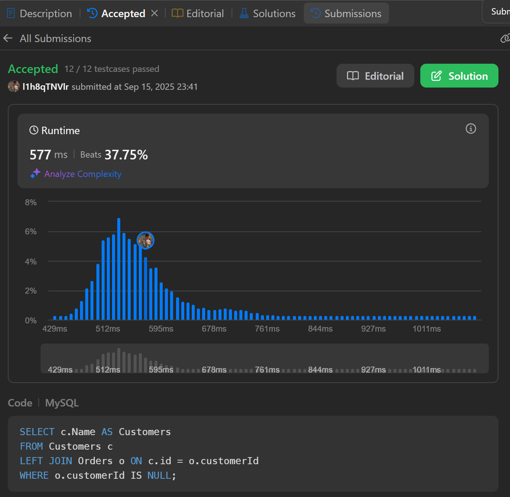

# Week2

# SQL_ADVANCED 2주차 정규 과제

## Week 2 :집합 연산자 & 그룹 함수

📌**SQL_ADVANCED 정규과제**는 매주 정해진 주제에 따라 **MySQL 공식 문서 또는 한글 블로그 자료를 참고해 개념을 정리한 후, 프로그래머스/ Solvesql / LeetCode에서 SQL 3문제**와 **추가 확인문제**를 직접 풀어보며 학습하는 과제입니다.

이번 주는 아래의 **SQL_ADVANCED_2nd_TIL**에 나열된 주제를 중심으로 개념을 학습하고, 주차별 **학습 목표**에 맞게 정리해주세요. 정리한 내용은 GitHub에 업로드한 후, **스프레드시트의 'SQL' 시트에 링크를 제출**해주세요.

**👀 (수행 인증샷은 필수입니다.)**

> 프로그래머스 문제를 풀고 '정답입니다' 문구를 캡쳐해서 올려주시면 됩니다.
> 

## SQL_ADVANCED_2nd

**1. 집합 연산자**

### 15.2.18. UNION Clause

### 15.2.14. Set Operations with UNION, INTERSECT

- UNION, UNION ALL 중심으로 개념을 정리하고, INTERSECT, EXCEPT는 구문이 어떤 기능을 하는지 간단히만 알아봅니다. EXCEPT와 INTERSECT는 대부분 MySQL 버전에서 공식 지원되지 않기 때문에, **이번주 학습은 `UNION, UNION ALL` 만 집중적으로 정리해주세요.**

**2. 그룹 함수 (집계 함수)**

### 14.19.1. Aggregate Function Descriptions

## 🏁 주차별 학습 (Study Schedule)

| 주차 | 공부 범위 | 완료 여부 |
| --- | --- | --- |
| 1주차 | 서브쿼리 & CTE | ✅ |
| 2주차 | 집합 연산자 & 그룹 함수 | ✅ |
| 3주차 | 윈도우 함수 | 🍽️ |
| 4주차 | Top N 쿼리 | 🍽️ |
| 5주차 | 계층형 질의와 셀프 조인 | 🍽️ |
| 6주차 | PIVOT / UNPIVOT | 🍽️ |
| 7주차 | 정규 표현식 | 🍽️ |

### 공식 문서 활용 팁

> MySQL 공식 문서는 영어로 제공되지만, 크롬 브라우저에서 공식 문서를 열고 이 페이지 번역하기에서 한국어를 선택하면 번역된 버전으로 확인할 수 있습니다. 다만, 번역본은 문맥이 어색한 부분이 종종 있으니 영어 원문과 한국어 번역본을 왔다 갔다 하며 확인하거나, 교육팀장의 정리 예시를 참고하셔도 괜찮습니다.
> 

# 1️⃣ 학습 내용

> 아래의 링크를 통해 MySQL 공식문서로 이동하실 수 있습니다.
> 
> - 15.2.18. UNION Clause : MySQL 공식문서
> 
> [https://dev.mysql.com/doc/refman/8.0/en/union.html](https://dev.mysql.com/doc/refman/8.0/en/union.html)
> 
> - 15.2.14. Set Operations with UNION, INTERSECT : MySQL 공식문서
> 
> [https://dev.mysql.com/doc/refman/8.0/en/set-operations.html](https://dev.mysql.com/doc/refman/8.0/en/set-operations.html)
> 
> (한국어 버전) [https://dart-b-official.github.io/posts/mysql-UNION/](https://dart-b-official.github.io/posts/mysql-UNION/)
> 
> - 14.19.1. Aggregate Function Descriptions : MySQL 공식문서
> 
> [https://dev.mysql.com/doc/refman/8.0/en/aggregate-functions.html](https://dev.mysql.com/doc/refman/8.0/en/aggregate-functions.html)
> 
> (한국어 버전) [https://dart-b-official.github.io/posts/mysql-aggregate_function/](https://dart-b-official.github.io/posts/mysql-aggregate_function/)
> 

# 2️⃣ 학습 내용 정리하기

## 1. 집합 연산자

두 개 이상의 `SELECT` 문의 결과를 하나의 결과 집합으로 결합할 때 사용.

`UNION`과 `UNION ALL`은 모두 여러 `SELECT` 문의 결과를 합치지만, **중복 값 처리 방식**에서 가장 큰 차이

- **`UNION` (또는 `UNION DISTINCT`)**
    - 여러 `SELECT` 문의 결과를 합친 후, **중복된 행을 모두 제거**하여 고유한 값만 남김.
    - 중복 제거를 위해 내부적으로 정렬과 같은 추가 작업이 발생하므로 `UNION ALL`보다 속도가 느릴 수 있음.
    - **사용 예시**: 여러 테이블에 나뉘어 있는 고객 목록을 합쳐 중복 없는 전체 고객 명단을 만들 때 사용.
    
    ```sql
    -- table_a의 모든 데이터 선택
    SELECT column1, column2 FROM table_a
    UNION
    -- table_b의 모든 데이터 선택 (table_a와 중복된 행은 결과에서 제외됨)
    SELECT column1, column2 FROM table_b;
    ```
    
- **`UNION ALL`**
    - 여러 `SELECT` 문의 결과를 **중복 제거 없이 그대로** 합침.
    - 중복 검사를 하지 않으므로 `UNION`보다 성능이 빠름.
    - **사용 예시**: 상반기 매출과 하반기 매출 데이터를 단순히 합쳐 전체 매출 내역을 확인할 때처럼 중복 여부와 상관없이 모든 데이터가 필요할 때 사용.
    
    ```sql
    -- table_a의 모든 데이터 선택
    SELECT column1, column2 FROM table_a
    UNION ALL
    -- table_b의 모든 데이터 선택 (중복 여부와 관계없이 모든 행이 결과에 포함됨)
    SELECT column1, column2 FROM table_b;
    ```
    

집합 연산자를 올바르게 사용하려면 다음 규칙을 지켜야 함.

- **컬럼 조건**
    - 결합하려는 모든 `SELECT` 문의 **컬럼 개수가 동일해야 함.**
    - 각 `SELECT` 문의 **같은 위치에 있는 컬럼끼리 데이터 타입이 호환되어야 함.** (예: 숫자 타입은 숫자 타입끼리, 문자 타입은 문자 타입끼리)
    - 최종 결과의 컬럼 이름은 **첫 번째 `SELECT` 문의 컬럼 이름**을 따름.
- **정렬 조건 (`ORDER BY`)**
    - 결과 전체를 정렬하려면, `ORDER BY` 절을 **가장 마지막 `UNION` 구문 뒤에 한 번만** 사용해야 함.
    - 각 `SELECT` 문 안에서는 `ORDER BY`를 사용할 수 없는 것이 원칙임. (단, 괄호로 묶고 `LIMIT`을 사용하면 개별 정렬이 가능하지만, 전체 결과가 정렬되는 것은 아님)
    
    ```sql
    -- 올바른 정렬 방법
    (SELECT name, signup_date FROM new_users)
    UNION
    (SELECT name, signup_date FROM existing_users)
    ORDER BY signup_date DESC; -- 전체 결과를 signup_date 내림차순으로 정렬
    ```
    

## 2. 그룹함수

여러 행의 데이터를 그룹화하여 하나의 요약된 결과 값을 반환하는 함수로, `GROUP BY` 절과 함께 자주 사용.

- **`COUNT(컬럼 또는 *)`**: 행의 개수를 셈.
    - `COUNT(*)`: `NULL` 값을 포함한 모든 행의 수를 반환.
    - `COUNT(컬럼명)`: 해당 컬럼에서 `NULL`이 아닌 값의 개수만 셈.
    - `COUNT(DISTINCT 컬럼명)`: 해당 컬럼에서 중복을 제외한 `NULL`이 아닌 값의 개수를 셈.
- **`SUM(컬럼명)`**: 해당 컬럼의 숫자 값들의 합계를 구함. (`NULL`은 무시)
- **`AVG(컬럼명)`**: 해당 컬럼의 숫자 값들의 평균을 구함. (`NULL`은 무시)
- **`MAX(컬럼명)`**: 해당 컬럼에서 최댓값을 찾음. (`NULL`은 무시)
- **`MIN(컬럼명)`**: 해당 컬럼에서 최솟값을 찾음. (`NULL`은 무시)

```sql
-- employees 테이블에서
SELECT
    COUNT(*) AS total_employees,         -- 전체 직원 수
    COUNT(bonus) AS bonus_recipients,    -- 보너스를 받은 직원 수 (bonus가 NULL이 아닌 경우)
    SUM(salary) AS total_salary,         -- 전체 연봉 합계
    AVG(salary) AS average_salary,       -- 평균 연봉
    MAX(salary) AS highest_salary,       -- 최고 연봉
    MIN(salary) AS lowest_salary         -- 최저 연봉
FROM employees;
```

- **`GROUP BY` 절**
    - 특정 컬럼의 값이 같은 행들을 하나의 그룹으로 묶음.
    - 그룹 함수는 이렇게 묶인 각 그룹에 대해 개별적으로 계산을 수행.
    - **`WHERE` 절은 그룹화하기 전**의 원본 데이터 행을 필터링.
    
    ```sql
    -- 각 부서(department)별 평균 연봉 계산
    SELECT department, AVG(salary)
    FROM employees
    WHERE hire_date > '2020-01-01' -- 2020년 이후 입사자만 대상으로
    GROUP BY department;          -- 부서별로 그룹화
    ```
    
- **`HAVING` 절**
    - **`GROUP BY`로 그룹화된 결과에 대해 조건을 적용**하여 특정 그룹만 필터링.
    - `HAVING` 절에는 그룹 함수를 사용한 조건을 쓸 수 있음. (예: `AVG(salary) > 5000`)
    - 실행 순서: `WHERE` (행 필터링) → `GROUP BY` (그룹화) → `HAVING` (그룹 필터링)
    
    ```sql
    -- 각 부서별 평균 연봉을 계산하되, 평균 연봉이 60000 이상인 부서만 조회
    SELECT department, AVG(salary)
    FROM employees
    GROUP BY department
    HAVING AVG(salary) >= 60000; -- 그룹화된 결과에 대한 조건 필터링
    ```
    

`NULL` 값은 집계 함수에서 매우 중요하게 다뤄지며, 함수의 종류에 따라 처리 방식이 다름.

- **`COUNT(*)`를 제외한 모든 집계 함수는 계산 시 `NULL` 값을 무시(제외)**
    - **`SUM`, `AVG`, `MAX`, `MIN`**: 컬럼 값 중 `NULL`이 있으면 그 행은 계산에서 아예 빠짐.
    - **`COUNT(컬럼명)`**: 해당 컬럼의 값이 `NULL`인 행은 개수에서 제외
    - **`COUNT(*)`**: 유일하게 `NULL` 값 여부와 상관없이 모든 행의 수를 셈.
- **`AVG` 함수와 `NULL`**
    - `AVG(컬럼)`은 `SUM(컬럼) / COUNT(컬럼)`으로 계산
    - 이때 `SUM`과 `COUNT` 모두 `NULL`을 제외하므로, 분모와 분자 모두에서 `NULL` 값은 영향을 주지 않음.
    - 예를 들어, `(10, 20, NULL)` 세 값이 있다면, 평균은 `(10 + 20) / 2`인 `15`가 됨. `(10 + 20 + 0) / 3`이 아님. 이 차이를 이해하는 것이 중요.

```sql
-- scores 테이블에 (100), (80), (NULL) 데이터가 있다고 가정
SELECT
    COUNT(*) AS total_rows,           -- 결과: 3 (NULL 포함 모든 행)
    COUNT(score) AS non_null_scores,  -- 결과: 2 (NULL 제외)
    AVG(score) AS average_score       -- 결과: 90.00 ((100+80)/2)
FROM scores;
```

---

# 3️⃣ 실습 문제

[https://leetcode.com/problems/customers-who-never-order/](https://leetcode.com/problems/customers-who-never-order/)

> LeetCode 183. Customers Who never Order
> 
> 
> 학습 포인트 : 주문 내역이 없는 고객을 찾기 위한 패턴 익히기
> 

[https://leetcode.com/problems/department-highest-salary/description/](https://leetcode.com/problems/department-highest-salary/description/)

> LeetCode 184. Department Highest Salary
> 
> 
> 학습 포인트 : 부서별 최고 연봉자 추출을 위한 **그룹별 정렬 / 필터링** 방식 이해하기
> 

---

## 문제 인증란




---

# 확인문제

## 문제 1

> 🧚동혁이는 SQL 문제를 풀면서 UNION과 UNION ALL의 차이를 명확히 이해하지 못해 중복된 값이 생기거나 누락되는 문제를 계속 겪고 있습니다. 아래는 동혁이가 작성한 쿼리입니다.
> 

```sql
SELECT name FROM member
UNION
SELECT name FROM blackList;

```

> 그런데 예상과 달리 blacklist에만 있는 이름이 결과에 안 나오거나, 중복된 이름이 사라져서 헷갈리고 있습니다. UNION과 UNION ALL의 차이를 설명하고, 중복 포함 여부에 따라 어떤 경우에 어떤 쿼리를 써야 하는지 예시와 함께 설명해주세요
> 

```
UNION과 UNION ALL의 가장 큰 차이점은 중복된 결과의 처리 여부
UNION: 두 쿼리 결과를 합친 후 중복된 행을 제거
UNION ALL: 중복 제거 없이 두 쿼리 결과를 그대로 모두 합침
```

**중복을 제외한 고유한 이름 목록이 필요할 때 (`UNION` 사용)**

```sql
SELECT name FROM member
UNION
SELECT name FROM blackList;
```

**중복을 포함한 모든 이름 목록이 필요할 때 (`UNION ALL` 사용)**

```sql
SELECT name FROM member
UNION ALL
SELECT name FROM blackList;
```