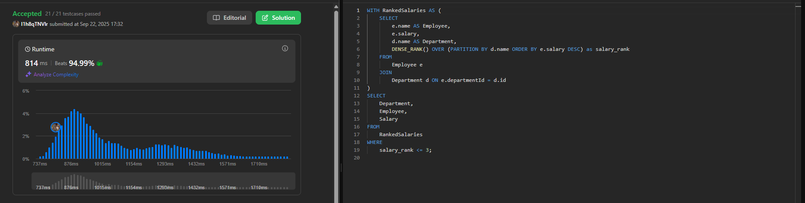

# Week3

# SQL_ADVANCED 3주차 정규 과제

## Week 3: 윈도우 함수 (Window Functions)

📌**SQL_ADVANCED 정규과제**는 매주 정해진 주제에 따라 **MySQL 공식 문서 또는 한글 블로그 자료를 참고해 개념을 정리한 후, 이번 주차에는 LeetCode SQL 문제 3문제**와 **추가 확인문제**를 직접 풀어보며 학습하는 과제입니다.

이번 주는 아래의 **SQL_ADVANCED_3rd_TIL**에 나열된 주제를 중심으로 개념을 학습하고, 주차별 **학습 목표**에 맞게 정리해주세요. 정리한 내용은 GitHub에 업로드한 후, **스프레드시트의 'SQL' 시트에 링크를 제출**해주세요.

**(수행 인증샷은 필수입니다.)**

> Leet code의 문제를 풀고 '정답입니다' 문구를 캡쳐해서 올려주시면 됩니다.
> 

## SQL_ADVANCED_3rd

### 14.20.2 Window Function Concepts and Syntax

### 14.20.1 Window Function Description

### 14.19.1 Aggregate Function Descriptions

- 위 문서 중 *14.19.1. Aggregate Function Descriptions* 문서에서 1주차 (집계 함수) 에서 다룬 부분을 제외하고 **OVER( ) 절을 활용한 윈도우 함수 문법과 `RANK( ), DENSE_RANK( ), ROW_NUMBER( ), LAG( ), LEAD( )`등 윈도우 함수 특유의 기능 중심으로 정리해주세요.**

## 🏁 강의 수강 (Study Schedule)

| 주차 | 공부 범위 | 완료 여부 |
| --- | --- | --- |
| 1주차 | 서브쿼리 & CTE | ✅ |
| 2주차 | 집합 연산자 & 그룹 함수 | ✅ |
| 3주차 | 윈도우 함수 | ✅ |
| 4주차 | Top N 쿼리 | 🍽️ |
| 5주차 | 계층형 질의와 셀프 조인 | 🍽️ |
| 6주차 | PIVOT / UNPIVOT | 🍽️ |
| 7주차 | 정규 표현식 | 🍽️ |

### 공식 문서 활용 팁

> MySQL 공식 문서는 영어로 제공되지만, 크롬 브라우저에서 공식 문서를 열고 이 페이지 번역하기에서 한국어를 선택하면 번역된 버전으로 확인할 수 있습니다. 다만, 번역본은 문맥이 어색한 부분이 종종 있으니 영어 원문과 한국어 번역본을 왔다 갔다 하며 확인하거나, 교육팀장의 정리 예시를 참고하셔도 괜찮습니다.
> 

# 1️⃣ 학습 내용

> 아래의 링크를 통해 MySQL 공식문서로 이동하실 수 있습니다.
> 
> - 14.20.2 Window Function Concepts and Syntax : MySQL 공식문서
> 
> [https://dev.mysql.com/doc/refman/8.0/en/window-functions-usage.html](https://dev.mysql.com/doc/refman/8.0/en/window-functions-usage.html)
> 
> (한국어 버전) [https://dart-b-official.github.io/posts/mysql-Window-Function/](https://dart-b-official.github.io/posts/mysql-Window-Function/)
> 
> - 14.20.1 Window Function Description : MySQL 공식문서
> 
> [https://dev.mysql.com/doc/refman/8.0/en/window-function-descriptions.html](https://dev.mysql.com/doc/refman/8.0/en/window-function-descriptions.html)
> 
> (한국어 버전) [https://dart-b-official.github.io/posts/mysql-Window-Function(2)/](https://dart-b-official.github.io/posts/mysql-Window-Function(2)/)
> 
> - 14.19.1 Aggregate Function Descriptions : MySQL 공식문서
> 
> [https://dev.mysql.com/doc/refman/8.0/en/aggregate-functions.html](https://dev.mysql.com/doc/refman/8.0/en/aggregate-functions.html)
> 
> (한국어 버전) [https://dart-b-official.github.io/posts/mysql-aggregate_function/](https://dart-b-official.github.io/posts/mysql-aggregate_function/)
> 

<br>

---

# 2️⃣ 학습 내용 정리하기

## WINDOW FUC

 데이터베이스 쿼리 내에서 행 단위의 복잡한 분석을 가능하게 하는 강력한 도구

윈도우 함수를 사용하면 집계 함수처럼 여러 행을 그룹화하여 하나의 결과로 만드는 것이 아니라, 각 행에 대해 개별적인 계산 결과를 반환할

윈도우 함수는 `OVER` 절과 함께 사용되어 분석의 대상이 되는 행의 집합, 즉 '윈도우'를 정의

### **OVER 절을 통한 윈도우 함수의 구조**

윈도우 함수는 `OVER` 절을 통해 어떤 행들을 계산에 포함할지 결정

 `OVER` 절은 다음과 같은 세 가지 주요요소로 구성

- **`PARTITION BY`**: 전체 데이터 집합을 특정 열의 값을 기준으로 작은 그룹(파티션)으로 분할
- **`ORDER BY`**: 각 파티션 내에서 행의 순서를 정렬. 이는 순위나 누적 합계를 계산할 때 필수적이며, 어떤 순서로 계산을 수행할지 결정
- **`frame_clause` (ROWS/RANGE)**: 파티션 내에서 현재 행을 기준으로 계산에 포함될 행의 범위를 더 세부적으로 지정

이러한 구조를 통해 윈도우 함수는 `SELECT` 문과 `ORDER BY` 절에서 사용되어, `FROM`, `WHERE`, `GROUP BY`, `HAVING` 절이 처리된 이후에 각 행에 대한 분석을 수행

### **RANK, DENSE_RANK, ROW_NUMBER의 차이**

`RANK`, `DENSE_RANK`, `ROW_NUMBER`는 모두 순위를 매기는 윈도우 함수이지만, 동점(동일한 값)을 처리하는 방식에  차이

- **`ROW_NUBER()`**: 파티션 내에서 각 행에 **고유한 순번**을 부여. 동점인 행이 있더라도 서로 다른 순번을 할당
- **`RANK()`**: 동점인 행에는 **같은 순위**를 부여하지만, 다음 순위는 동점인 행의 수만큼 건너뛰어 계산
- **`DENSE_RANK()`**: `RANK()`와 마찬가지로 동점인 행에 **같은 순위**를 부여하지만, 순위를 건너뛰지 않고 **연속적으로** 부여

| 함수 | 설명 | 예시 (점수: 100, 90, 90, 80) |
| --- | --- | --- |
| **`ROW_NUMBER()`** | 고유한 순번 부여 | 1, 2, 3, 4 |
| **`RANK()`** | 동점 순위 부여 (순위 건너뛰기) | 1, 2, 2, 4 |
| **`DENSE_RANK()`** | 동점 순위 부여 (연속 순위) | 1, 2, 2, 3 |

### **LAG와 LEAD 함의 활용**

`LAG`와 `LEAD` 함수는 현재 행을 기준으로 파티션 내의 **이전 또는 이후 행의 값**을 가져올 때 사용

- **`LAG(expression, offset, default)`**: 현재 행보다 `offset`만큼 **앞에 있는 행**의 `expression` 값을 반환. `offset`의 기본값은 1이며, 해당 행이 없을 경우 `default` 값이 반환. 주로 이전 기간과의 데이터 비교에 사용
- **`LEAD(expression, offset, default)`**: 현재 행보다 `offset`만큼 **뒤에 있는 행**의 `expression` 값을 반환. `LAG`와 마찬가지로 `offset`과 `default` 값을 지정할 수 있으며, 이후 기간과의 데이터 비교에 활용

---

# 3️⃣ 실습 문제

## LeetCode 문제

[https://leetcode.com/problems/department-top-three-salaries/](https://leetcode.com/problems/department-top-three-salaries/)

> LeetCode 185. Department Top Three Salaries
> 
> 
> 학습 포인트 : DENSE_RANK( ) + PARTITION BY 사용으로 그룹 내 상위 N개 추출
> 

[https://leetcode.com/problems/consecutive-numbers/](https://leetcode.com/problems/consecutive-numbers/)

> LeetCode 180. Consecutive Numbers
> 
> 
> 학습 포인트 : LAG( ) 함수로 이전 값과 비교하여 연속 데이터 탐지
> 

[https://leetcode.com/problems/last-person-to-fit-in-the-bus/](https://leetcode.com/problems/last-person-to-fit-in-the-bus/)

> LeetCode 2481. Last Person to Fit in the Bus
> 
> 
> 학습 포인트 : SUM( ) OVER (ORDER BY ...) 로 누적 합계 계산 후 조건 필터링
> 

---

## 문제 인증란




---

# 확인문제

## 문제 1

> 🧚예린이는 고객별로 얼마나 많은 주문을 하는지 분석하기 위해, 고객의 주문 목록에 주문 순서를 표시하는 쿼리를 작성해보았습니다. 이때 주문일 순서대로 각 고객의 주문 번호를 매기기 위해 윈도우 함수를 활용했습니다.
> 

```sql
SELECT customer_id, order_id, order_date,
       ROW_NUMBER() OVER (PARTITION BY customer_id ORDER BY order_date) AS order_rank
FROM Orders;

```

> 이번에는 예린이에게 "윈도우 함수를 쓰지 않고 동일한 결과를 만들어보라"는 미션을 받았습니다. 예린이는 이 작업을 어떻게 해야할지 막막합니다. 예린이를 도와 ROW_NUMBER() 윈도우 함수 없이 동일한 결과를 서브쿼리나 JOIN을 사용해서 작성해보세요.
> 

```sql
SELECT
    o1.customer_id,
    o1.order_id,
    o1.order_date,
    (
        SELECT COUNT(*)
        FROM Orders o2
        WHERE o2.customer_id = o1.customer_id
          AND o2.order_date <= o1.order_date
    ) AS order_rank
FROM
    Orders o1
ORDER BY
    o1.customer_id,
    o1.order_date;
```

### 🎉 수고하셨습니다.