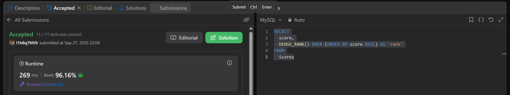

# Week4

# SQL_ADVANCED 4주차 정규 과제

## Week 4 : TOP-N 쿼리

📌**SQL_ADVANCED 정규과제**는 매주 정해진 주제에 따라 **MySQL 공식 문서 또는 한글 블로그 자료를 참고해 개념을 정리한 후, 프로그래머스, SolveSql, LeetCode 중에서 SQL 문제 4문제**와 **추가 확인문제**를 직접 풀어보며 학습하는 과제입니다.

이번 주는 아래의 **SQL_ADVANCED_4th_TIL**에 나열된 주제를 중심으로 개념을 학습하고, 주차별 **학습 목표**에 맞게 정리해주세요. 정리한 내용은 GitHub에 업로드한 후, **스프레드시트의 'SQL' 시트에 링크를 제출**해주세요.

**(수행 인증샷은 필수입니다.)**

> 프로그래머스 문제를 풀고 '정답입니다' 문구를 캡쳐해서 올려주시면 됩니다.
> 

## SQL_ADVANCED_4th

### 15.2.13. SELECT Statement

- `ORDER BY, LIMIT, LIMIT and Subqueries` 중심으로 학습해주세요.

## 🏁 강의 수강 (Study Schedule)

| 주차 | 공부 범위 | 완료 여부 |
| --- | --- | --- |
| 1주차 | 서브쿼리 & CTE | ✅ |
| 2주차 | 집합 연산자 & 그룹 함수 | ✅ |
| 3주차 | 윈도우 함수 | ✅ |
| 4주차 | Top N 쿼리 | ✅ |
| 5주차 | 계층형 질의와 셀프 조인 | 🍽️ |
| 6주차 | PIVOT / UNPIVOT | 🍽️ |
| 7주차 | 정규 표현식 | 🍽️ |

### 공식 문서 활용 팁

> MySQL 공식 문서는 영어로 제공되지만, 크롬 브라우저에서 공식 문서를 열고 이 페이지 번역하기에서 한국어를 선택하면 번역된 버전으로 확인할 수 있습니다. 다만, 번역본은 문맥이 어색한 부분이 종종 있으니 영어 원문과 한국어 번역본을 왔다 갔다 하며 확인하거나, 교육팀장의 정리 예시를 참고하셔도 괜찮습니다.
> 

# 1️⃣ 학습 내용

> 아래의 링크를 통해 MySQL 공식문서로 이동하실 수 있습니다.
> 
> - 15.2.13 SELECT Statement : MySQL 공식문서
> 
> [https://dev.mysql.com/doc/refman/8.0/en/select.html#order-by-optimization](https://dev.mysql.com/doc/refman/8.0/en/select.html#order-by-optimization)
> 
> (한국어 버전) [https://dart-b-official.github.io/posts/mysql-TopN/](https://dart-b-official.github.io/posts/mysql-TopN/)
> 

---

# 2️⃣ 학습 내용 정리하기

### 1. Top-N 쿼리 최적화의

MySQL에서 `ORDER BY`와 `LIMIT n`이 함께 사용될 때, 옵티마이저는 전체 데이터를 모두 정렬하는 비효율적인 작업을 피하고자 함

- **전체 정렬 회피**: `LIMIT`이 없는 `ORDER BY`는 조건에 맞는 모든 행을 찾아 정렬.  하지만 `LIMIT n`이 추가되면, MySQL은 정렬된 순서에서 상위 `n`개의 행만 찾으면 되기 때문에 나머지 데이터는 정렬 불필요
- **효율적인 메모리 사용**: 옵티마이저는 `n`개의 행을 담을 수 있는 메모리 공간을 확보하고, 전체 테이블을 스캔하면서 현재까지의 상위 `n`개에 해당하는 행만 유지. 새로운 행이 기존의 상위 `n`개보다 순위가 높으면, 가장 낮은 순위의 행을 제거하고 새로운 행을 추가.
- **인덱스 활용**: 만약 `ORDER BY` 절에 사용된 컬럼에 인덱스 있다면, MySQL은 가장 효율적인 방식으로 동작. 인덱스는 이미 데이터가 정렬된 상태이므로, 인덱스를 따라 순서대로 `n`개의 행만 읽으면 쿼리가 종료. 이는 테이블 전체를 스캔하는 것보다 월등히 빠름

### 2. LIMIT을 이용한 간단한 순위 집계

- **SubQuery/RANK() 대체**: 과거에는 상위 N개를 조회하기 위해 서브쿼리에서 데이터를 정렬한 후 바깥쪽 쿼리에서 행 번호를 부여해 필터링하거나, `RANK()`와 같은 윈도우 함수를 사용
    
    ```sql
    -- RANK() 함수를 사용한 예시
    SELECT name, score
    FROM (
      SELECT name, score, RANK() OVER (ORDER BY score DESC) as ranking
      FROM players
    ) AS ranked_players
    WHERE ranking <= 10;
    ```
    
- **LIMIT의 간결함**: `LIMIT`을 사용
    
    ```sql
    -- LIMIT을 사용한 간결한 Top-N 쿼리
    SELECT name, score
    FROM players
    ORDER BY score DESC
    LIMIT 10;
    ```
    

복잡한 순위 로직(예: 동일 순위 처리)이 필요하지 않은 대부분의 순위 집계는 서브쿼리나 `RANK()` 대신 `LIMIT`을 활용하여 더 간단하고 성능 좋은 쿼리를 작성하는 것이 권장

---

# 3️⃣ 실습 문제

## 문제

[https://leetcode.com/problems/rank-scores/](https://leetcode.com/problems/rank-scores/)

> LeetCode 178. Rank Scores
> 
> 
> 학습 포인트 : DENSE_RANK( )를 활용하여 점수별 순위 부여, 동점자 처리, 윈도우 함수 복습
> 

[https://school.programmers.co.kr/learn/courses/30/lessons/133027](https://school.programmers.co.kr/learn/courses/30/lessons/133027)

> 프로그래머스 : 주문량이 많은 아이스크림들 조회하기 (Lev 4)
> 
> 
> Hint
> 
> - 문제 핵심은 '총 주문량 합산' 입니다.
> - 두 테이블을 '세로로' 합쳐야합니다.
>     - 저희는 이 부분을 1주차에 `UNION ALL` 을 통해 방법을 배웠습니다.
> - 합쳐진 테이블에서 FLAVOR 별로 그룹화해 주문량을 합산하세요.
> - 상위 3개를 추출 = 주문량 기준으로 내림차순하여 이번에 학습한 것을 사용해야 합니다.

---

## 문제 인증란




---

# 확인문제

## 문제 1

> 🧚영리는 지역별로 가장 인기 있는 식당 2곳씩을 뽑기 위해 다음과 같은 UNION ALL 기반 쿼리를 작성했습니다.
> 

```sql
(
  SELECT region, restaurant_name, review_count
  FROM Restaurants
  WHERE region = '서울'
  ORDER BY review_count DESC
  LIMIT 2
)
UNION ALL
(
  SELECT region, restaurant_name, review_count
  FROM Restaurants
  WHERE region = '부산'
  ORDER BY review_count DESC
  LIMIT 2
)
UNION ALL
(
  SELECT region, restaurant_name, review_count
  FROM Restaurants
  WHERE region = '대구'
  ORDER BY review_count DESC
  LIMIT 2
);

```

> 쿼리는 잘 작동하긴 하지만, 지역을 더 추가해달라는 재원이의 부탁으로 UNION ALL 블록을 계속 추가하게 되어 관리가 어려울 것 같아서 힘들어하고 있었습니다. 여러분들은 이 쿼리를 윈도우 함수로 변경하여 더 쉽게 리팩토링을 하려고 합니다. 민서를 도와서 UNION ALL 없이 RANK( ) 또는 ROW_NUMBER( ) 윈도우 함수를 사용해, 각 지역별로 리뷰 수가 가장 많은 상위 2개 식당을 추출하는 쿼리를 작성해보세요.
> 

```sql

WITH RankedRestaurants AS (
  SELECT
    region,
    restaurant_name,
    review_count,
    RANK() OVER (PARTITION BY region ORDER BY review_count DESC) as ranking
  FROM
    Restaurants
)

SELECT
  region,
  restaurant_name,
  review_count
FROM
  RankedRestaurants
WHERE
  ranking <= 2
```

### 🎉 수고하셨습니다.