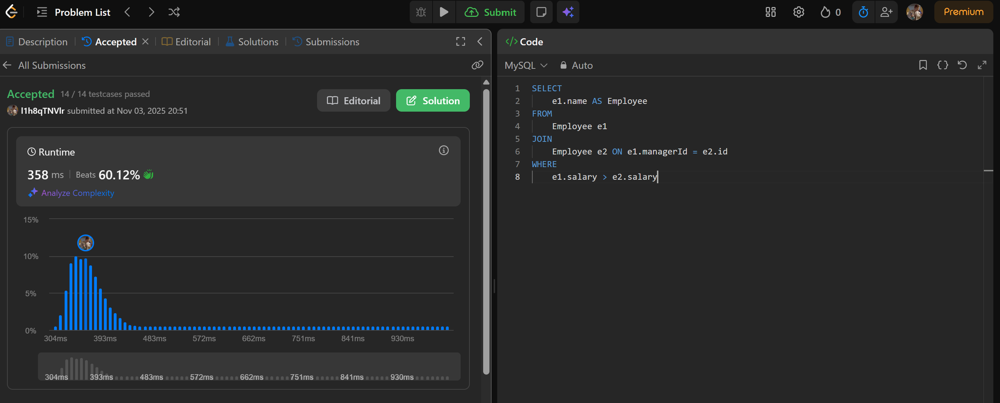

# Week5

# SQL_ADVANCED 5주차 정규 과제

## Week 5 : 계층형 질의 & 셀프 조인

📌**SQL_ADVANCED 정규과제**는 매주 정해진 주제에 따라 **MySQL 공식 문서 또는 한글 블로그 자료를 참고해 개념을 정리한 후, 프로그래머스 SQL 문제 3문제**와 **추가 확인문제**를 직접 풀어보며 학습하는 과제입니다.

이번 주는 아래의 **SQL_ADVANCED_5th_TIL**에 나열된 주제를 중심으로 개념을 학습하고, 주차별 **학습 목표**에 맞게 정리해주세요. 정리한 내용은 GitHub에 업로드한 후, **스프레드시트의 'SQL' 시트에 링크를 제출**해주세요.

**(수행 인증샷은 필수입니다.)**

> 프로그래머스 문제를 풀고 '정답입니다' 문구를 캡쳐해서 올려주시면 됩니다.
> 

## SQL_ADVANCED_5th

### 15.2.20 WITH (Common Table Expressions)

- **재귀 CTE를 통한 계층형 구조 탐색 방법을 중심으로 학습해주세요.**

> Self Join은 따로 MySQL 공식문서가 없습니다. 다른 블로그나 유튜브 영상을 참고하여 스스로 학습하고, 넣어주세요.
> 

## 🏁 강의 수강 (Study Schedule)

| 주차 | 공부 범위 | 완료 여부 |
| --- | --- | --- |
| 1주차 | 서브쿼리 & CTE | ✅ |
| 2주차 | 집합 연산자 & 그룹 함수 | ✅ |
| 3주차 | 윈도우 함수 | ✅ |
| 4주차 | Top N 쿼리 | ✅ |
| 5주차 | 계층형 질의와 셀프 조인 | ✅ |
| 6주차 | PIVOT / UNPIVOT | 🍽️ |
| 7주차 | 정규 표현식 | 🍽️ |

### 공식 문서 활용 팁

> MySQL 공식 문서는 영어로 제공되지만, 크롬 브라우저에서 공식 문서를 열고 이 페이지 번역하기에서 한국어를 선택하면 번역된 버전으로 확인할 수 있습니다. 다만, 번역본은 문맥이 어색한 부분이 종종 있으니 영어 원문과 한국어 번역본을 왔다 갔다 하며 확인하거나, 교육팀장의 정리 예시를 참고하셔도 괜찮습니다.
> 

# 1️⃣ 학습 내용

> 아래의 링크를 통해 MySQL 공식문서로 이동하실 수 있습니다.
> 
> - 15.2.20 WITH (Common Table Expressions) : MySQL 공식문서
> 
> [https://dev.mysql.com/doc/refman/8.0/en/with.html](https://dev.mysql.com/doc/refman/8.0/en/with.html)
> 
> (한국어 버전) [https://dart-b-official.github.io/posts/mysql-RecursiveWith/](https://dart-b-official.github.io/posts/mysql-RecursiveWith/)
> 

<br>

---

# 2️⃣ 학습 내용 정리하기

## 계층형 질의 (WITH RECURSIVE)

`WITH RECURSIVE`는 자기 자신을 참조할 수 있는 CTE(Common Table Expression)를 정의하는 구문

이는 조직도, 부품 트리, 메뉴 구조, 친구 관계 등 깊이를 미리 알 수 없는 계층 구조나 그래프를 순회(traverse)하는 데 필수적

### `WITH RECURSIVE`의 구조

`WITH RECURSIVE` CTE는 두 부분으로 구성되며, `UNION ALL` (또는 `UNION`)로 결합

1. **앵커 멤버 (Anchor Member):**
    - 재귀의 시작점(기본 케이스)이 되는 쿼리
    - 자기 자신(CTE)을 참조하지 않음
    - 예: 조직도에서 최상위 CEO를 찾는 쿼리
2. **재귀 멤버 (Recursive Member):**
    - CTE 자기 자신을 참조하여 이전 단계의 결과와 조인하는 쿼리
    - 이 부분이 반복적으로 실행되며 계층을 한 단계씩 확장
    - 예: 이전 단계에서 찾은 관리자(manager)에게 보고하는 직원을 찾는 쿼리

재귀는 재귀 멤버가 더 이상 새로운 행을 반환하지 않을 때 중지

## 셀프 조인 (Self-Join)과의 비교

`WITH RECURSIVE`가 도입되기 전(MySQL 8.0 이전), 계층 구조를 쿼리하는 주된 방법 중 하나는 셀프 조인

### 셀프 조인 (Self-Join) 방식

- **정의:** 하나의 테이블이 자기 자신을 조인하는 방식 (예: `FROM employees e1 JOIN employees e2 ON e1.manager_id = e2.employee_id`)
- **용도:** 주로 *고정된* 깊이의 관계를 찾는 데 사용
    - 예: 특정 직원의 직속 상사 찾기 (1단계)
    - 예: 특정 직원의 '상사의 상사' 찾기 (2단계, 테이블을 3번 조인)
- **한계점:**
    - **임의의 깊이 처리 불가:** 계층의 깊이를 미리 알 수 없는 경우(예: "특정 관리자 하위의 모든 직원 찾기"), 셀프 조인만으로는 한계가 명확
    - **복잡성 및 성능:** 계층의 깊이만큼 테이블을 계속 조인해야 하므로 쿼리가 매우 복잡해지고, 깊이가 깊어질수록 성능이 급격히 저하

### `WITH RECURSIVE`와의 핵심 비교

| 특징 | 셀프 조인 (Self-Join) | `WITH RECURSIVE` |
| --- | --- | --- |
| **주요 용도** | 고정된(얕은) 깊이의 관계 | 임의의(깊은) 계층 구조 순회 |
| **유연성** | 낮음 (깊이가 정해져 있어야 함) | 높음 (계층의 깊이와 무관하게 작동) |
| **쿼리 복잡도** | 깊어질수록 매우 복잡해짐 | 단일 쿼리로 일관성 있게 작성 가능 |
| **성능** | 깊은 계층에서 비효율적 | 계층 구조 처리에 최적화됨 |
| **MySQL 지원** | 모든 버전 | MySQL 8.0 이상 |

---

# 3️⃣ 실습 문제

## 문제

- [https://leetcode.com/problems/employees-earning-more-than-their-managers/](https://leetcode.com/problems/employees-earning-more-than-their-managers/)

> LeetCode 181. Employees  Earning More Than Their Managers
> 
> 
> 학습 포인트 : 동일 테이블을 두 번 조인 (왜 동일 테이블을 JOIN 해야하는 문제일까)
> 
- [https://leetcode.com/problems/tree-node/description/](https://leetcode.com/problems/tree-node/description/)

> LeetCode 608. Tree Node
> 
> 
> 학습 포인트 : id, parent_id 기반의 트리 구조에서 **부모 ~ 자식 관계 재귀 탐색**
> 
> Hint : (문제 해석)
> 
> - 어떤 노드가 Root Node 이려면, 부모노드가 존재하지 않아야 한다.
> - 어떤 노드가 Inner Node 이려면, 나를 부모로 가지는 노드가 하나 이상 존재하여야 한다.
>     - 그 외네는 모두 Leaf Node 이다. --> (CASE 문을 사용하는 것을 추천드립니다.)
- [https://school.programmers.co.kr/learn/courses/30/lessons/144856](https://school.programmers.co.kr/learn/courses/30/lessons/144856)

> 프로그래머스 : 저자 별 카테고리 별 매출액 집계하기
> 
> 
> 학습 포인트 : 카테고리와 서브카테고리 계층 구조를 분석하는 로직, SELF JOIN / CTE를 다 활용할 수 있다.
> 
> - 위에 2가지의 문제를 풀어보고 난 이후, 더 편리한 방법으로 문제를 풀어보세요.

---

## 문제 인증란




---

# 확인문제

## 문제 1

> 🧚윤서는 어떤 기업의 조직 구조를 분석하는 SQL 쿼리를 작성하고 있습니다. 각 직원은 상위 관리자 ID(manager_id)를 가지며, 조직도는 같은 Employees 테이블 내에서 계층적으로 연결됩니다. 윤서는 최상위 관리자부터 각 사원까지의 계층 깊이(depth)를 계산하고자 다음과 같은 SELF JOIN 기반 쿼리를 시도했습니다.
> 

```sql
SELECT e1.id, e1.name, e2.name AS manager_name
FROM Employees e1
LEFT JOIN Employees e2 ON e1.manager_id = e2.id;

```

> 쿼리를 잘 작성했다고 생각을 했지만, 막상 실행을 해보니 1단계 매니저까지만 추적할 수 있어 계층 구조의 전체를  표현하는데 한계가 존재했습니다. 이에 여러분에게 다음과 같은 미션을 요청합니다. WITH RECURSIVE를 활용하여  최상위 관리자부터 시작해 각 직원까지의 조직 구조 계층 깊이(depth)를 구하고, 결과를 depth가 높은 순으로 정렬하는 쿼리를 작성하세요.
> 

```sql
WITH RECURSIVE employee_hierarchy (id, name, manager_id, depth) AS (
  
  SELECT 
    id, 
    name, 
    manager_id, 
    0 AS depth
  FROM 
    Employees
  WHERE 
    manager_id IS NULL

  UNION ALL
  
  SELECT
    e.id, 
    e.name, 
    e.manager_id, 
    h.depth + 1 
  FROM 
    Employees e
  JOIN 
    employee_hierarchy h ON e.manager_id = h.id
)

SELECT 
  id, 
  name, 
  manager_id, 
  depth 
FROM 
  employee_hierarchy
ORDER BY 
  depth DESC
```

---

### 🎉 수고하셨습니다.