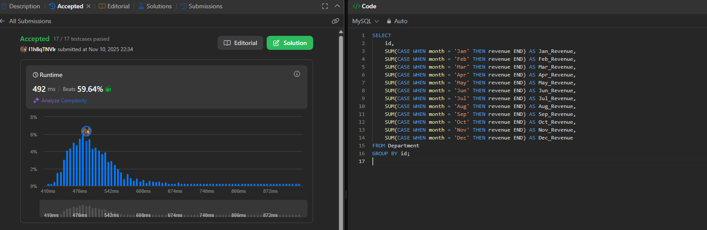

# Week6

# SQL_ADVANCED 6주차 정규 과제

## **Week 6 : PIVOT / UNPIVOT**

📌**SQL_ADVANCED 정규과제**는 매주 정해진 주제에 따라 **MySQL 공식 문서 또는 한글 블로그 자료를 참고해 개념을 정리한 후, 프로그래머스 SQL 문제 3문제**와 **추가 확인문제**를 직접 풀어보며 학습하는 과제입니다.

이번 주는 아래의 **SQL_ADVANCED_6th_TIL**에 나열된 주제를 중심으로 개념을 학습하고, 주차별 **학습 목표**에 맞게 정리해주세요. 정리한 내용은 GitHub에 업로드한 후, **스프레드시트의 ‘SQL’ 시트에 링크를 제출**해주세요.

**(수행 인증샷은 필수입니다.)**

> 프로그래머스 문제를 풀고 ‘정답입니다’ 문구를 캡쳐해서 올려주시면 됩니다.
> 

---

## **SQL_ADVANCED_6th_TIL**

- MySQL 공식문서에는 `PIVOT / UNPIVOT`에 대한 **전용 문법을 제공하지 않고 있습니다.** 따라서 이번 주차에서는 PIVOT / UNPIVOT에 대한 개념을 이해하고, 이를 `CASE WHEN + GROUP BY` 또는 `UNION ALL` 등의 조합으로 수동 구현할 수 있는 방법을 학습하면 됩니다.

## **🏁 강의 수강 (Study Schedule)**

| **주차** | **공부 범위** | **완료 여부** |
| --- | --- | --- |
| 1주차 | 서브쿼리 & CTE | ✅ |
| 2주차 | 집합 연산자 & 그룹 함수 | ✅ |
| 3주차 | 윈도우 함수 | ✅ |
| 4주차 | Top N 쿼리 | ✅ |
| 5주차 | 계층형 질의 & 셀프 조인 | ✅ |
| 6주차 | PIVOT / UNPIVOT | ✅ |
| 7주차 | 정규 표현식 | 🍽️ |

<br>

# 1️⃣ 학습 내용

**참고할 자료를 아래에 같이 첨부합니다.**

<!-- 꼭 아래의 자료를 참고하지 않고, 개인적인 학습 방법으로 진행하셔도 좋습니다. -->

1. **PIVOT / UNPIVOT 개념 학습 Blog**

[https://m.blog.naver.com/regenesis90/222205833002](https://m.blog.naver.com/regenesis90/222205833002)

[https://blog.naver.com/regenesis90/222205964866](https://blog.naver.com/regenesis90/222205964866)

1. **MySQL 로 PIVOT 구현하기**

[https://shxrecord.tistory.com/181](https://shxrecord.tistory.com/181)

<br>

---

# 2️⃣ 학습 내용 정리하기

## PIVOT: 행(Row)을 열(Column)로

PIVOT은 특정 열이 가진 고유한 값들을 새로운 열(Column) 헤더로 만들고, 데이터를 재배치하는 작업

- **목적:** 데이터를 요약하거나 크로스탭(Crosstab) 보고서 형태로 분석하기 용이하게 만드는 데 사용
- **작동 방식:**
    1. **기준 열(Identifier):** 그룹화의 기준이 되는 열 (예: UserID)
    2. **피벗 열(Pivot Column):** 새로운 열 이름이 될 값들이 포함된 열 (예: Month)
    3. **집계 열(Aggregation):** PIVOT된 새 셀에 채워질 값. `SUM`, `AVG`, `COUNT` 등 집계 함수와 함께 사용

---

## UNPIVOT: 열(Column)을 행(Row)으로

UNPIVOT은 PIVOT의 반대 작업. 넓게 펼쳐진 여러 열(Column)을 다시 속성(Attribute)과 값(Value)으로 구분하여 행(Row) 형태로 변환

- **목적:** 넓은 형식의 데이터를 정규화된 형태(긴 형식)로 되돌려 저장하거나 다른 시스템에서 처리하기 용이하게
- **작동 방식:** 여러 개의 열(예: '1월', '2월')을 두 개의 새로운 열(예: 'Month' 열, 'Sales' 열)로 변환

---

## MySQL에서의 PIVOT 구현 방법

MySQL은 MS-SQL Server나 Oracle과 달리 `PIVOT` 내장 함수를 미지원

따라서 **`CASE` 문**과 **집계 함수(예: `SUM`, `MAX`)**, 그리고 **`GROUP BY`** 절을 조합하여 PIVOT을 수동으로 구현

### `CASE` 문을 이용한 PIVOT (정적 피벗)

가장 표준적인 구현 방식. `GROUP BY`로 기준 열을 묶고, `CASE` 문을 사용해 피벗 열의 각 값에 해당하는 데이터만 선택적으로 집계

---

# 3️⃣ 실습 문제

## Leetcode 문제

[https://leetcode.com/problems/reformat-department-table/description/](https://leetcode.com/problems/reformat-department-table/description/)

> LeetCode. Reformat Department Table
> 
> 
> 학습 포인트 : MySQL 에서는 PIVOT을 쉽게 구할 수 있는 방법이 없다.
> 
> - 수동으로 구하기 : CASE WHEN + 집계함수 / GROUP BY + 조건 분기 사용

## 문제 인증란



## 확인 문제

### 문제 1

> 🧚지희는 매월 각 매장의 월별 매출 데이터가 담긴 테이블을 가공하려 합니다. 아래와 같은 테이블이 있다고 가정합시다.
> 

| **branch** | **Jan_sales** | **Feb_sales** | **Mar_sales** |
| --- | --- | --- | --- |
| A | 100 | 120 | 130 |
| B | 90 | 110 | 140 |

> Q. 이 테이블을 아래와 같은 형태로 바꾸고 싶습니다. SQL에서 UNION ALL을 활용하여 UNPIVOT 구조를 수동으로 구현해보세요.
> 

| **branch** | **month** | **sales** |
| --- | --- | --- |
| A | Jan | 100 |
| A | Feb | 120 |
| A | Mar | 130 |
| B | Jan | 90 |
| B | Feb | 110 |
| B | Mar | 140 |

```sql
SELECT branch, 'Jan' AS month, Jan_sales AS sales
FROM sales_table
UNION ALL
SELECT branch, 'Feb' AS month, Feb_sales AS sales
FROM sales_table
UNION ALL
SELECT branch, 'Mar' AS month, Mar_sales AS sales
FROM sales_table;
```

### 문제 2

> 🧚태연이는 지점별로 월별 매출을 한 눈에 보기 위해, 아래와 같이 매출 데이터가 저장된 데이터를 가공하려고 합니다.
> 

| **branch** | **month** | **sales** |
| --- | --- | --- |
| A | Jan | 100 |
| A | Feb | 120 |
| A | Mar | 130 |
| B | Jan | 90 |
| B | Feb | 110 |
| B | Mar | 140 |

> 이 데이터를 아래와 같이 월별 매출 컬럼이 각각 존재하도록 PIVOT 형태로 바꾸고 싶습니다.MySQL에서는 PIVOT 문법이 없기 때문에, CASE WHEN, GROUP BY, MAX() 또는 SUM() 등을 이용해 수동으로 구현해보세요.
> 
- 원하는 결과

| **branch** | **Jan_sales** | **Feb_sales** | **Mar_sales** |
| --- | --- | --- | --- |
| A | 100 | 120 | 130 |
| B | 90 | 110 | 140 |

```sql
SELECT
    branch,
    SUM(CASE WHEN month = 'Jan' THEN sales END) AS Jan_sales,
    SUM(CASE WHEN month = 'Feb' THEN sales END) AS Feb_sales,
    SUM(CASE WHEN month = 'Mar' THEN sales END) AS Mar_sales
FROM sales_table
GROUP BY branch

```

### **🎉 수고하셨습니다.**