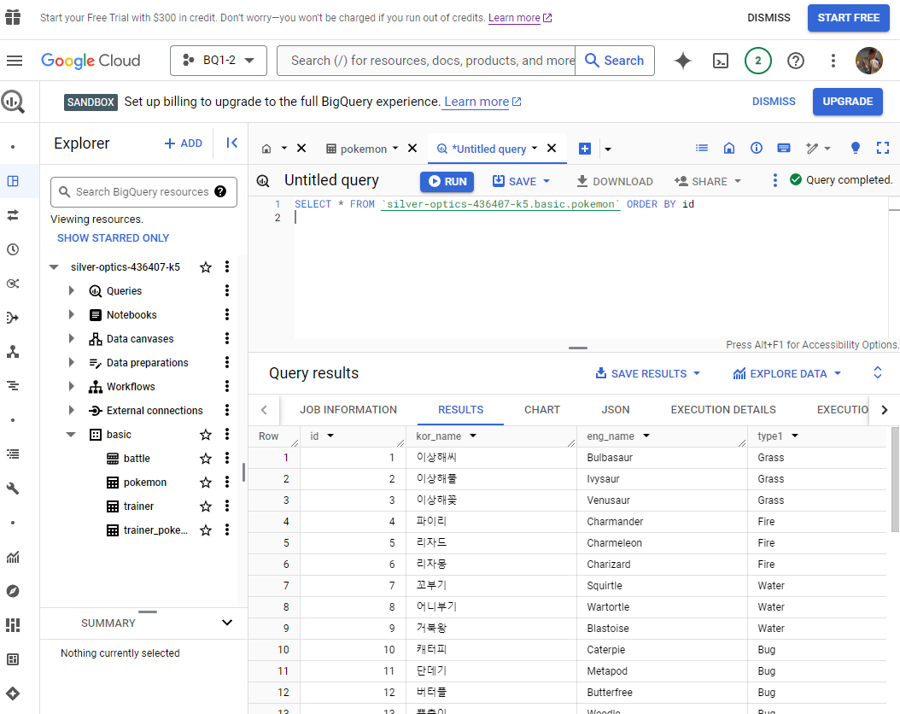

# w1

# 1-1. BigQuery 기초

## 데이터 저장 형태

데이터는 보통 DB (MySQL, Oracle, PostgreSQL 등) 내 table 등에 저장→ 제품에서 사용

### OLTP; Online Transaction Processing

: 거래위한 DB - 보류/중간 상태 없음 (데이터 무결)

INSERT/UPDATE 빈번

→ SQL 사용 가능하나 분석 위한 DB가 아니라 쿼리 속도 느릴 수 있음

### SQL

: DB에서 데이터 가져올때 사용하는 언어

쿼리문 / SQL: 쿼리 등으로 표

### Table

|  | column | column |
| --- | --- | --- |
| row |  |  |
| row |  |  |

row : 하나의 고유 데이터

column : 각 데이터의 특정 속성 값

### OLAP; Onlin Analytical Processing

: 분석 위한 기능 제공

### DW

: 데이터 한 곳에 모아 저장, 

DB & 웹 & API 로그 

### BigQuery

: Google 클라우드의 DW

1. 난이도 낮음 
2. OLAP로 속도 향상 (비용 요구)
3. Firebase, Google Analytic4 의 데이터 추출 용이
    
    기기/위치/OS/이벤트 행동 등
    
4. DW 사용 위해 서버 미요구
    
    AWS EC2와 같이 Google에서 인프라를 관리
    

⇒ Firebase, Google Analytic4의 사용 / 적은 비용인력투자 조건에서 많이 사용

### BigQuery 비용 (US)

- 쿼리 비용 Compute Pricing
    - On demand : 처리된 용량만큼 부과 ($6.25/TB)
    - Capacity : Slot 단위 요금 부과 ($0.04/slot)
- 저장 비용 Storage Pricing
    - Active logical : ($0.02/G)
    - Longterm logical : ($0.01/G)

# 1-2. BigQuery 환경설정

## BigQueary 환경 구성요소

### 1) 프로젝트

하나의 큰 선물, 단일 프로젝트 내 여러 데이터셋이 존재 가능

### 2) Dataset

프로젝트 내 창고, 판매-고객 등 별도의 데이터 저장 가능

단일 데이터셋에 여러 테이블 존재

### 3) Table

행-열로 이루어진 데이터들이 저장

# 2-1. 데이터 활용 Overview

### 데이터 활용 과정

task → 문제 정의 (So what / why so)→ 원하는 것 정의 → 데이터 탐색  → 단일/다량 자료(연결) →

- 조건(필터링)
- 추출
- 변환
- 요약(집계)

→ 데이터 결과 검증 → 피드백 & 활용

데이터 탐색 & 결과 검증 시 SQL 활용

# 2-2. 저장된 데이터 확인하기 (DB, DW, ERD)

## 데이터의 저장 형태 확인 - ERD

ERD; Entity Relationship Diagram : DB 구조를 한번에 보기위해 확인

Product / Order / Customer : table

### ERD 없는 경우

→ 모든 DB를 직접 보면서 탐색

- 테이블의 종류
- 컬럼의 종류
- 테이블간 연결에 사용되는 컬럼
- 컬럼 값은 어떤 의미를 가지는가

spreadsheet나 문서로 따로 정

## 기업 내 존재 데이터 예시

### 서비스 사용 DB

유저 / 배송 / 상품 테이블

### 로그데이터

앱웹내 사용 기록 데이터

### 공공데이터, 서드파티 데이터

