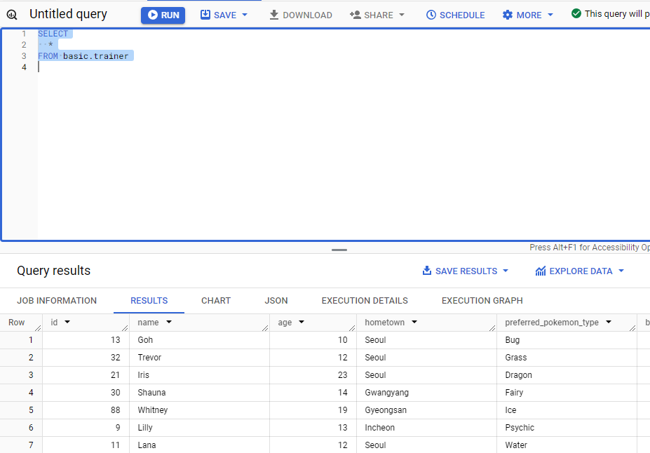

# w2

# 2-3. 데이터 탐색; SELECT / FROM / WHERE

## SQL Query 구조

```sql
SELECT
	Col1 AS new_name,
	Col2,
	Col3
FROM basic.Table
WHERE Col1 = 1
```

### SELECT

: 테이블의 어떤 column을 선택할 것인가?

### FROM

: 어떤 테이블에서 데이터를 확인할 것인가

### WHERE

: 원하는 조건

### 예시 1

```sql
SELECT
	*
FROM project.pokemon
WHERE type1 = "Fire"
```

`*` : 모든 column 출력 → Google BigQuery에서 Preview로 지

`SELECT * EXCEPT (Columns to exclude)` 형태 가능

## pokemon table 실습

```sql
SELECT 
  id AS pokemon_id,
  kor_name,
  type1,
  total
FROM `silver-optics-436407-k5.basic.pokemon`
WHERE
  type1 = "Fire"
```

### 테이블 명시 형식

:  **`project id.dataset.table`**
프로젝트 id는 명시할 필요 없으나 여러 프로젝트에 있어 명시 권장

프로젝트 id 명시하지 않는 경우 apostrophe생략 가

### 기타

- AS 뒤에는 문자열 형식으로 명시하지 않음
- semicolon단위로 쿼리 작성 가능

## 정리

SELECT - FROM - WHERE 순 작성

### SELECT

Table에 저장되어있는 column 선택

여러 column 명시 가능

`Column AS nickanme`으로 지정 가

### FROM

데이터 확인할 Table 명시

`AS nickname`으로 지정 가능

### WHERE

FROM에 명시된 Table에 저장된 데이터 조건 필터링

column 기준

# 2-4. SELECT 연습문

## 1. tainer 테이블의 모든 데이터 확인

```sql
SELECT
  *
FROM basic.trainer
```



## 2. trainer 테이블의 트레이너 name 출력

```sql
SELECT
  name
FROM basic.trainer

```


## 3. trainer 테이블의name, age 출력

```sql
SELECT
  name,
  age

FROM basic.trainer
```

## 4. trainer 테이블 id=3 트레이너의 name, age, hometown

```sql
SELECT
  name,
  age,
  hometown
FROM basic.trainer
WHERE
	id=3
```


## 5.pokemon 테이블에서 pikachu의 공격력 체력 확인

```sql
SELECT
  name,
  age,
  hometown
FROM basic.trainer
WHERE
	id=3
```


# 2-5. 집계; GROUP BY / HAVING / SUM & COUNT

## GROUP BY

: 같은 값끼리 모으면서 그룹화

특정 칼럼 기준으로 모으면서 다른 컬럼에서 집계 가능


```sql
SELECT
	Column,
	Function  
FROM table
GROUP BY
	Column
```

집계할 Column을 SELECT에 명시하고, GROUP BY에 작성

> 집계함수 종류

[Aggregate functions  |  BigQuery  |  Google Cloud](https://cloud.google.com/bigquery/docs/reference/standard-sql/aggregate_functions)

### DISTINCT

: 고유unique값을 알고 싶은 경우; 중복을 제거

```sql
SELECT
	Column,
	COUNT(DISTINCT Column)
FROM table
GROUP BY
	Column
```

### 그룹화 집계 활용 포인트

- 일자별 집계
- 연령대별 집계
- 타입별 집계
- 앱 화면별 집계 등

…..

## HAVING / WHERE

### WHERE

: table에 바로 조건을 설정하고 싶은 경우

```sql
SELECT
  generation,
  COUNT(DISTINCT kor_name)
FROM basic.pokemon
WHERE
	generation >= 2
```

### HAVING

: GROUP BY 한 후 조건을 설정하고 싶은 경우

```sql
SELECT
  generation,
  COUNT(DISTINCT kor_name) AS countNUM
FROM basic.pokemon
GROUP BY generation
HAVING
	countNUM>105
```

## Sub Query

: SELECT문 안에 존재하는 SELECT 뭐리

FROM 절 안에 또 다른 SELECT 문 넣을 수 있음. 괄호로 묶어 사용

SubQ + WHERE conditioning == SubQuery HAVING

## ORDER BY

```sql
SELECT
	column
FROM tabel
ORDER BY column DESC/ASC
```

보통 쿼리의 맨 아래 작성

## LIMIT

: 출력 개수의 제한

보통 쿼리문의 제일 마지막에 작성

```sql
SELECT
	column
FROM tabel
LIMIT 10
```

## 문제

### 문제1. pokemon 테이블의 포켓몬 수 구하는 쿼리

```sql
SELECT
  COUNT(DISTINCT kor_name)
FROM basic.pokemon
```

### 문제2. pokemon이 세대수 별로 얼마나 있는

```sql
SELECT
  generation,
  COUNT(DISTINCT kor_name)
FROM basic.pokemon
GROUP BY
  generation
```


### 문제3. 포켓몬 수 타입별로 집계, 10이상인 타입만 확인. 많은순으로 정렬

```sql
SELECT
  type1,
  COUNT(DISTINCT kor_name) AS ponum
FROM basic.pokemon
GROUP BY
  type1
HAVING
  ponum >= 10
ORDER BY ponum DESC
```

