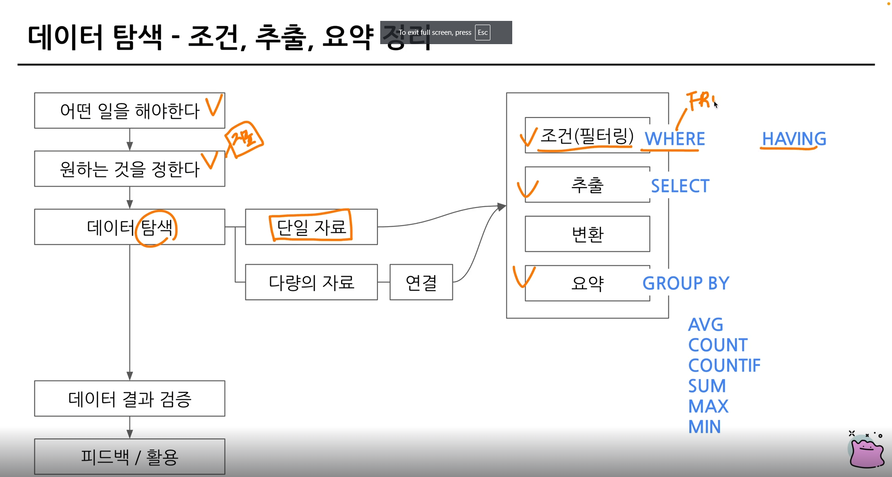

# w3

- 조건
- 어떤 테이블
- 어떤 칼럼
- 어떻게 집계?

### 연습문제 1 - 포켓몬 중 type2가 없는 포켓몬 수를 작성

```sql
SELECT 
  COUNT(id) AS cnt
FROM basic.pokemon
WHERE type2 IS NULL
```

### 연습문제 2 - type2가 없는 포켓몬의 type1과 그type1의 포켓몬 수를 알려주는 쿼리. type1의 포켓몬 수 큰 순 정

```sql
SELECT 
  type1,
  COUNT(id) AS cnt
FROM 
  basic.pokemon
WHERE 
  type2 IS NULL
GROUP BY 
  type1
ORDER BY COUNT(id) DESC

```

### 연습문제 3 - type2 상관없이 type1의 포켓몬 수를 알 수 있는 쿼리

```sql
SELECT
  type1,
  COUNT(type1) as cnt
FROM basic.pokemon
GROUP BY type1
```

- DISTINCT는 유니크한 값만 알고 싶은 경우
- id의 경우는 중복이 없게 설계되었으므로 서로 다르지 않

### 연습문제 4 - 전설 여부에 따른 포켓몬 수를 알 수 있는 쿼

```sql
SELECT
  is_legendary,
  COUNT(id) AS cnt
FROM basic.pokemon
GROUP BY
  is_legendary
```

- GROUP_BY에 칼럼이 많은 경우
- GROUP BY 1 ⇒ SELECT의 첫 칼럼 의

### 연습문제 5 - 동명이인이 있는 이름은 무엇

```sql
SELECT
  name
FROM basic.trainer
GROUP BY
  name
HAVING 
  COUNT(name) >= 2
```

- WHERE : 원본 데이터 FROm 절의 데이터에 조건
- HAVING : GROUP BY와 함께 집계 결과에 조건

### 연습문제 6  - trainer 테이블에서 iris 트레이너의 정보를 알 수 있는 쿼리

```sql
SELECT
  *
FROM basic.trainer
WHERE name = 'Iris'
```

### 연습문제 7 - trainer 테이블에서 iris, Whitney, Chynthia 트레이너의 정보를 알 수 있는 쿼리

```sql
SELECT
  *
FROM basic.trainer
WHERE name IN ('Iris', 'Whitney','Cynthia ')
```

### 연습문제 8 - 전체 포켓몬

```sql
SELECT
  COUNT(id) 
FROM basic.pokemon

```

### 연습문제 9 - 세대별 포켓몬

```sql
SELECT
  generation,
  COUNT(id) 
FROM basic.pokemon
GROUP BY generation

```

### 연습문제 10 - type2 가 존재하는 포켓몬의

```sql
SELECT
  COUNT(id) 
FROM basic.pokemon
WHERE type2 IS NOT NULL

```

### 연습문제 11 -type2가 있는 포켓몬 중에 제일 많은 type1

```sql
SELECT
  type1, 
  COUNT(id) 
FROM basic.pokemon
WHERE type2 IS NOT NULL
GROUP BY
  type1
ORDER BY COUNT(id) DESC
```

### 연습문제 12 - 단일 타입 포켓몬 중 가장 많은 type1

```sql
SELECT
  type1, 
  COUNT(id) 
FROM basic.pokemon
WHERE type2 IS NULL
GROUP BY
  type1
ORDER BY COUNT(id) DESC
```

### 연습문제 13 - 포켓몬 이름에 ‘파’가 들어가는 포켓몬

```sql
SELECT
  kor_name
FROM basic.pokemon
WHERE kor_name LIKE '파%'
```

### 연습문제 14 - 뱃지가 6개 이상인 트레이너

```sql
SELECT
  name,
  badge_count
FROM basic.trainer
WHERE badge_count >=6
```

### 연습문제 15 - 보유한 포켓몬이 제일 많은 트레이너

```sql
SELECT
  trainer_id,
  COUNT(pokemon_id) AS cnt
FROM basic.trainer_pokemon
GROUP BY
  trainer_id
ORDER BY
  cnt DESC
```

### 연습문제 16 - 포켓몬을 가장 많이 풀어준 트레이

```sql
SELECT
  trainer_id,
  COUNT(pokemon_id) AS cnt
FROM basic.trainer_pokemon
WHERE 
  status= 'Released'
GROUP BY
  trainer_id
ORDER BY
 cnt DESC
```

### 연습문제 17 - 트레이너 별로 풀어준 포켓몬의 비율이 20% 넘는 포켓몬 트레이너

```sql
SELECT
  trainer_id,
  COUNTIF(status="Released") AS cnt,
  COUNT(pokemon_id) AS pcnt,
  COUNTIF(status="Released") / COUNT(pokemon_id) AS rcnt
FROM basic.trainer_pokemon
GROUP BY
  trainer_id
HAVING 
  rcnt >= 0.2
```

## 데이터 탐색 정리



### Noo Function : `GROUP BY ALL`

## SQL 쿼리 작성 흐름

### 1. 지표 고민

: 어떤 문제에 어떤 데이터가 필요한가

### 2. 지표 구체화

: 추상적이지 않고 구체적인 지표 명시

### 3. 지표 탐색

: 유사 케이스 해결 확인 - 해당 쿼리 리뷰

### 4. 쿼리 작성

: 없는 경우 - 데이터가 있는 테이블 찾기

- 1개
- 2개 이상 - 연결방법 고민  (JOIN)

### 5. 데이터 정합성 확인

: 예상한 결과와 동일한지 확인

### 6. 쿼리 가독성

: 나중을 위해ㅔ

### 7. 쿼리 저장

: 쿼리는 재사용 되므로 문서로 저장

## 쿼리 작성 템플릿

- 쿼리 작성 목표와 지표
- 쿼리 계산 방법
- 데이터 기간
- 사용할 테이블
- JOIN Key
- 데이터 특

### 생산성 도구 : Espanso

→ 특정 단어 입력하면 원하는 문장으로 변환

터미널에서 espanso edit을 통해 바로 수정 파일 base.yml로 접근