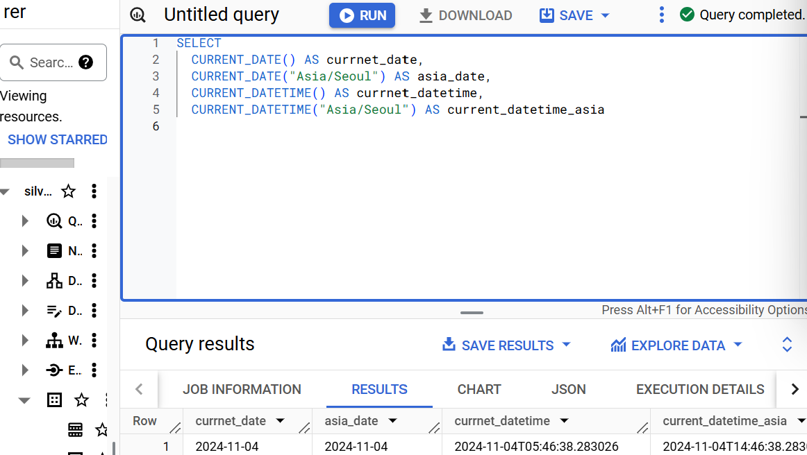

# w5

### `CURRENT_DATETIME([time_zone])`

현재 DATETIME 출력



### `EXTRACT`

DATETIME에서 특정 부분만 추출하고 싶은 경우

- 요일 추출하고 싶은 경우
    
    `EXTRACT(DAYOFWEEK FROM datetime_column)`
    
    : 한주의 첫날이 일요일인 [1,7] 범위의 값을 반
    


### `DATETIME_TRUNC(datetime_col, HOUR)`

DATE와 HOUR만 남기고 싶은 경우 ⇒ 시간 자르기


### `PARSE_DATETIME(’문자열 형태’, ‘DATETIME 문자열’) AS datetime`

: str → DATETIME

Format Element 문서보면서 형태 구성


### `FORMAT_DATETIME()`

: DATETIME → str


### `LAST_DAY`

: 자동으로 월의 마지막 값을 계산


### `DATETIME_DIFF`

: DATETIME 간 차이


## 연습문제

### 연습문제1

> **catch_date를 기준으로 2023년 1월에 포획한 포켓몬 수**
> 

# 쿼리를 작성하는 목표, 확인할 자료 : 포켓몬 수

# 쿼리 계산 방법 : COUNT

# 데이터의 기간 : 2023 JAN

# 사용할 테이블 : trainer_pokemon

# Join KEY : X

# 데이터 특징 : 

- catch_date : DATE
- catch_datetime : UTC TImestamp

→ catch_date : 시간대 기준 ㅇㄷ?


⇒ 칼럼을 확인하고 쿼리 작성하

### 연습문제 2

> **battle_datetime 기준으로 6am~6pm 사이 일어난 배틀**
> 

# 쿼리를 작성하는 목표, 확인할 자료 : 6am~6pm 배틀 수 

# 쿼리 계산 방법 : COUNT

# 데이터의 기간 :  6am~6pm

# 사용할 테이블 : battle

# Join KEY : X

# 데이터 특징 : 

- battle_data  : DATE
- battle_datetime : DATETIME
- battle_timestamp : TIMESTAMP


### 연습문제 3

> 트레이너 별로 첫 catch_date 찾아서 DD/MM/YYYY 형식 출
> 

# 쿼리를 작성하는 목표, 확인할 자료 : 날짜 형식 변경

# 쿼리 계산 방법 : FORMAT_DATETIME + MIN

# 데이터의 기간 :  X

# 사용할 테이블 : trainer_pokemon

# Join KEY : X

# 데이터 특징 : catch_datetime 사용해야 한국기준


### 연습문제 4

> **battle_date 기준으로 요일별로 얼마나 자주 일어났는가**
> 

# 쿼리를 작성하는 목표, 확인할 자료 : 요일별 빈번수

# 쿼리 계산 방법 : 요일별 COUNT

# 데이터의 기간 :  X

# 사용할 테이블 : battle

# Join KEY : X

# 데이터 특징 :


### 연습문제 5

> **트레이너가 포켓몬 처음으로 포획한 날짜와 마지막으로 포획한 날짜의 간격이 큰 순으로 정렬**
> 

# 쿼리를 작성하는 목표, 확인할 자료 : diff 큰순정렬

# 쿼리 계산 방법 : MIN& ?? → DATETIME_DIFF ⇒ ORDER BY

# 데이터의 기간 :  X

# 사용할 테이블 : trainer_pokemon

# Join KEY : X

# 데이터 특징 : catch_datetime 사용 for KST


## 조건문

### WHY?

**특정 카테고리 하나로 합치는 전처리 필요한 경우**

→ 데이터 저장 / 분석이 나뉨

→필요한 부분에서 조건 설정해서 변경하는게 더 유용

→ 저장할때 합쳐 저장하면 쪼개볼수 없음

### `CASE WHEN`

: 여러 조건이 있을 경우 유용

```sql
SELECT
	CASE
		WHEN case THEN result
		WHEN case2 THEN result2
		ELSE notincase THEN resultncase
END AS newcolumn
```


쿼리 조건 분류 순서 주의해야

: 조건 2개 모두 해당하면 선행하는 조건에 따

### `IF`

단일조건시 유용

```sql
SELECT
	IF(case, 'resultsame', 'resultnotsame') AS result1,
	IF(case, 'resultsame', 'resultnotsame') AS result2
```

## 연습문제

### 연습문제 1

> **포켓몬 Speed 70이상이면 빠름아니면 느림으로 표시하는 칼럼 생성**
> 


### 연습문제 2

> **포켓몬 type1에 따라 물/불/전기 번역하고 나머지는 기타로 분류하는 column 생성**
> 


### 연습문제 3

> **포켓몬 total에 따라 300이하 low, 500이라 mid, 500 초과 high**
> 


### 연습문제 4

> **badge count 기준 분류**
> 


### 연습문제 5

> **catch_date 2023-01-01이후면 Recent, 아니면 Old**
> 


### 연습문제 6

> **배틀에서 winner_id = player_id 이면 Player1 Wins, 반대면 반대로, 아니면 Draw**
> 


## BigQuery Official Docs

[BigQuery documentation  |  Google Cloud](https://cloud.google.com/bigquery/docs)

