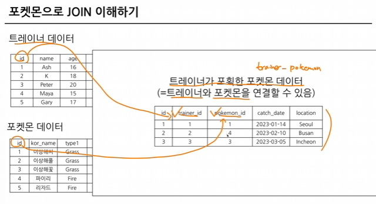

# w6

### SQL JOIN

: 서로 다른 데이터 테이블을 연결하는 것 - 공통적으로 존재하는 column; key가 있는 경우

- 보통 id값을 Key로 많이 사용
- 특정 범위로도 가




### JOIN을 해야하는 이유

- RDBMS 설계시 정규화를 거침
    
    → 중복을 최소화하도록 데이터 구조화하는 것
    
- 데이터 개발 관점에서는 분리되어있는것이 좋음
- 대신 DW에서 JOIN+연상해서 DM을 만들어서 활

### SQL JOIN의 종류

- INNER JOIN : 두 테이블의 공통 요소만 연결
- LEFT/RIGHT JOIN : 왼/오른 테이블 기준 연겨
- FULL JOIN : 양쪽 기준 연결
- CROSS JOIN : 두 테이블 각각 요소 곱하기


### SQL JOIN Query flow

1. 테이블 확인 : 저장된 데이터, 칼럼 확인
2. 기준 테이블 정의 : 가장 많이 참고할 기준base 테이블 정의
3. JOIN key 찾기 : 여러 Table과 연결할 Key 정의
4. 결과 예상하기
5. 쿼리작성및 검증 : 예상과 동일하게 나오는

### SQL JOIN 문법

`FROM` 하단에 `JOIN`할 Table 작성하고, `ON` 뒤에 공통된 칼럼을 작성

```sql
SELECT
	A.col1,
	A.col2,
	B.col1 1,
	B.col2 2
FROM table1 AS A
LEFT JOIN table2 AS B
ON A.key = B.key
```

CROSS JOIN은 `ON` 구문이 필수가 아님

### trainer_id 기준으로 트레이너데이터 연결하기


```sql
SELECT
  tp.*,
  t.*,
  p.*
FROM basic.trainer_pokemon AS tp

LEFT JOIN basic.trainer AS t
ON tp.trainer_id = t.id

LEFT JOIN basic.pokemon AS p
ON tp.pokemon_id = p.id
```

- id_1은 id라는 결과가 중복되었기에 이렇게나타남
    - → t.* EXCEPT (id) & p.* EXCEPT (id)
        
        :  tp에 있으니 그걸 활용하겠다
        

### 고민

1. 어떤 JOIN 사용? → 작업의 목적에 따라
    - 교집합 : INNER
    - 모두조합 : CROSS
    - else : LEFT/RIGHT. LEFT 사용을 추천
2. 어떤 table이 왼쪽, 오른쪽일까 → 기준이되는 테이블이 왼쪽
    
    : 기준에는 기준값이 존재, 우측에 데이터 계속 추가
    
3. 여러 테이블 연결 가능? → JOIN개수에 한계는 없으나 좋지는 않음
    
    : 3~5개
    
    - 너무 많다 싶으면 중간 테이블로 관리
        
        
        
4. 컬럼은 모두 선택해야 하나?
    
    → 데이터 추출 목적에 따라 다름
    
    - 처음에는 많은 컬럼 선택해도 되나 사용 안할 컬럼은 선택하지 않는 것이 비용효율적
    - id같은 값은 uniqueness 확인에 자주 사용되므로 자주 사용하는 편

## 연습문제

### 연습문제 1

트레이너가 보유한 포켓몬

```sql
SELECT
  kor_name,
  COUNT(tp.id) AS pokemon_cnt
FROM(
  SELECT
    id,
    trainer_id,
    pokemon_id,
    status
  FROM `basic.trainer_pokemon`
  WHERE
    status IN ("Active", "Training")
) AS tp
LEFT JOIN basic.pokemon AS p
ON tp.pokemon_id = p.id
GROUP BY
  kor_name
```


### 연습문제 2

각 트레이너가 가진 포켓몬 중 Grass 타입 포켓몬 수 계산


### 연습문제3

hometown과 location을 비교하여 고향에서 포획한 트레이너 수를 계산


### 연습문제4

Master 등급의 트레이너는 어떤 타입 포켓몬을 가장 많이 가지나요


### 연습문제5

인천 추신 트레이너는 1, 2세대 각각 얼마나 보유하나요

