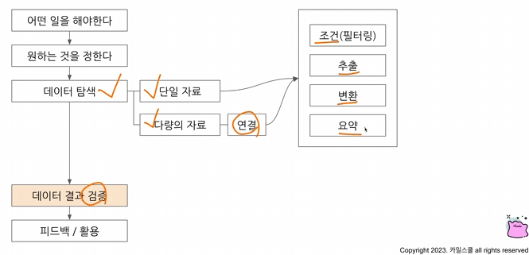

# w7



## 가독성 위한 SQL 스타일

[SQL style guide by Simon Holywell](https://www.sqlstyle.guide/)

[SQL Style Guide - Mozilla Data Documentation](https://docs.telemetry.mozilla.org/concepts/sql_style)

### 1. 예약어는 대문자로 작성

`SELECT` / `FROM` / `WHERE` 등

### 2. 컬럼이름은 snake_case

`CamelCase`가 아닌 `snake_case`로 작성

### 3. 명시적 vs 암시

Alias (`AS`) 별칭 지을 때는 명시적 이름을 사용

### 4. 왼쪽 정렬

기본적으로 왼쪽 정렬을 기준으로 작성

### 5. 예약어나 칼럼은 한줄에 하나씩

→ 바로 주석 처리가 가능한 장점이 있음

### 6. 쉼표는 컬럼 바로 뒤

BigQuery는 마지막 쉼표를 무시해서 뒤에 작성해도 무

## `WITH` 구문

→ 쿼리를 작설하며 아래 쿼리가다른곳에서 반복되는 경우 복잡성 증가, 가독성 하락

: WITH문을 통해 쿼리를 정의해서 재사용 가능

```sql
SELECT
	col, col2
FROM (
	SELECT 
		col, col2, col3
	FROM table_
)
```

```sql
WITH temp_table AS (
	SELECT 
		col, col2, col3
	FROM 
		table_
)

SELECT
	col, col2
FROM temp_table
```

- CTE; Common Table Expression으로 표현
- SELECT 구문에 이름 정하는 것과 유사
- 쿼리 내 반복적 사용 가능

```sql
WITH base AS (
	---
) implicit AS (
	---
)

SELECT
	---
```

## PARTITION

: 테이블에 partition이 존재할 수 있음

### 장점

1. 쿼리 성능 향상
2. 데이터 관리 용이
3. 성능 비용 절약

### Case


: 20241119부터 하루 전날의 데이터 추출하는 쿼리


## 데이터 결과 검증

: SQL 쿼리 후 나온 결과가 예상과 일치하는지 확인하는 과정

→ 분석 결과 정확성&신뢰성 확보

- 문제 잘 정의하고 미리 작성해보기
- 도메인 특수성 잘 파악하기
1. **문제정의 확인**
    
    구체적인 문제 정의, 요청사항 확인
    
2. **Input/Output**
    - 인풋 아웃풋 작성하기
    - 중간 결과 생각하기
3. 쿼리 작성
    
    가독성 챙기기
    
4. 결과 비교


### 결과 검증할때 자주 활용하는 쿼리

1. `COUNT(*)` : 행 수 체크
2. `NOT NULL` : NULL 확인
3. `DISTINCT` : 중복 여부 확인
4. `IF` / `CASE WHEN` : 의도 와 같다면 TRUE, 아니면 FASLE

### 기타 검증 방식

1. 특정 user_id로 필터링 결어서 확인
    1. 1명 데이터 확인
    2. 결과 에상할 때 Raw데이터에서 하나씩 눈으로 세고 적어둠
    3. 1명 에상 결과와 쿼리 비교
    4. 다른 id 더 추가해서 확인
    5. 모두 동일한 결과 나오면 종료
2. 샘플 데이터 생성
    1. WITH문으로 예시 데이터 생성
    2. 결과 예상하고 쿼리 작성
    3. 복잡한 데이터에서 하기 전 쿼리 자체가 올바른지 확인

### 데이터 결과 검증 예시

트레이너의 배틀 성적 분석 : 각 트레이너 배틀 승리 비율 계산 (참여 획수 9 이상인 경우만)

1. 전체 데이터 파악
2. id선정
    
    
    
3. 승률 직접 COUNT
    
    = 0.555…
    
4. 쿼리 작성
    - 통합 데이터 생성
        
        ```sql
        SELECT
          *
        FROM (
          SELECT
            id AS battle_id,
            player1_id AS trainer_id,
            winner_id
          FROM basic.battle
          UNION ALL   
          SELECT
            id AS battle_id,
            player2_id AS trainer_id,
            winner_id
          
          FROM basic.battle
        )
        ORDER BY battle_id
        ```
        
        
        
    - trainer_id=7인 총 배틀 횟수 구하기
        
        ```sql
        WITH battle_basic AS (
          SELECT
            id AS battle_id,
            player1_id AS trainer_id,
            winner_id
          FROM basic.battle
          UNION ALL   
          SELECT
            id AS battle_id,
            player2_id AS trainer_id,
            winner_id
          
          FROM basic.battle
        )
        
        SELECT
          trainer_id,
          COUNT(*) AS total_battles,
          COUNT(DISTINCT battle_id) AS unique_battles
        FROM battle_basic
        WHERE trainer_id=7
        GROUP BY
          trainer_id
        ```
        
        
        
    - trainer_id와 winner_id 조합해서 WIN/LOSE/DRAW
        
        ```sql
        WITH battle_basic AS (
          SELECT
            id AS battle_id,
            player1_id AS trainer_id,
            winner_id
          FROM basic.battle
          UNION ALL   
          SELECT
            id AS battle_id,
            player2_id AS trainer_id,
            winner_id
          
          FROM basic.battle
        )
        
        SELECT
          *,
          CASE
            WHEN trainer_id = winner_id THEN "WIN"
            WHEN winner_id IS NULL THEN "DRAW"
            ELSE "LOSE"
          END AS battle_result
        FROM battle_basic
        WHERE trainer_id=7
        ```
        
        
        
5. 실제와 비교
    
    COUNTIF로  값 구하기
    
    ```sql
    WITH battle_basic AS (
      SELECT
        id AS battle_id,
        player1_id AS trainer_id,
        winner_id
      FROM basic.battle
      UNION ALL   
      SELECT
        id AS battle_id,
        player2_id AS trainer_id,
        winner_id
      
      FROM basic.battle
    ), battle_w_result AS (
      SELECT
      *,
      CASE
        WHEN trainer_id = winner_id THEN "WIN"
        WHEN winner_id IS NULL THEN "DRAW"
        ELSE "LOSE"
      END AS battle_result
      FROM battle_basic
      WHERE trainer_id=7
    )
    
    SELECT
      trainer_id,
      COUNTIF(battle_result="WIN") AS win_count,
      COUNT(battle_id) AS total_battle_count,
      COUNTIF(battle_result="WIN")/COUNT(DISTINCT battle_id) AS win_ratio
    FROM battle_w_result
    GROUP BY
      trainer_id
    ```
    
    
    
6. 맞다면 유저 조건 제외
    
    ```sql
    WITH battle_basic AS (
      SELECT
        id AS battle_id,
        player1_id AS trainer_id,
        winner_id
      FROM basic.battle
      UNION ALL   
      SELECT
        id AS battle_id,
        player2_id AS trainer_id,
        winner_id
      
      FROM basic.battle
    ), battle_w_result AS (
      SELECT
      *,
      CASE
        WHEN trainer_id = winner_id THEN "WIN"
        WHEN winner_id IS NULL THEN "DRAW"
        ELSE "LOSE"
      END AS battle_result
      FROM battle_basic
      -- WHERE trainer_id=7
    )
    
    SELECT
      trainer_id,
      COUNTIF(battle_result="WIN") AS win_count,
      COUNT(battle_id) AS total_battle_count,
      COUNTIF(battle_result="WIN")/COUNT(DISTINCT battle_id) AS win_ratio
    FROM battle_w_result
    GROUP BY
      trainer_id
    HAVING
      total_battle_count >= 9
    ```
    
    