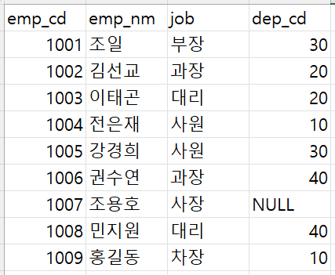

# 3rd_week

# 08 분석 프로젝트 준비 및 기획

## 1. 데이터 분석의 전체 프로세스

데이터 분석의 근본적 목적은 **의사결정 최적화**이며, 다음의 3단계로 구성된다.

### (1) 설계 단계

- **과제 정의 및 범위 설정(Scope 설정)**
- **프로젝트 인력 구성 및 프로젝트 매니저(PM) 확보**
- **실무자와 분석가 간 협의 체계 수립**
    - 주기적 소통 (예: 주 1회 미팅 권장)

### (2) 분석 및 모델링 단계

- **데이터 마트(Data Mart) 구축**
- **데이터 준비 → 가공 → 분석 → 모델 도출**
- **모델 검증 및 실무자/경영진 협의**
    - 주요 분석 방법론 활용
        
        (**CRISP-DM, SEMMA, KDD 등**)
        

### (3) 구축 및 활용 단계

- **모델 적용 및 시스템 구축**
- **성과 평가** 및 추가·보완 프로젝트 검토
- 성과 측정 (A/B 테스트 포함)

> 프로세스는 반드시 단방향이 아니라 반복적이고 유연하게 진행될 수 있다.
> 
> 
> 프로젝트 중간에도 목적과 방향이 재조정될 수 있다.
> 

## 2. 데이터 분석 방법론

### (1) CRISP-DM 방법론 (Cross Industry Standard Process for Data Mining)

데이터 마이닝 분야에서 가장 널리 쓰이는 방법론으로 총 **6단계**로 구성된다.

1. **비즈니스 이해**
    - 현재 상황 평가, 목표 설정, 프로젝트 계획 수립
2. **데이터 이해**
    - 데이터 설명, 탐색, 품질 확인
3. **데이터 준비**
    - 선택, 정제(Cleaning), 필수 데이터 구성, 통합(Integration)
4. **모델링**
    - 모델링 기법 선정, 테스트 디자인 생성, 모델 생성 및 평가
5. **평가**
    - 결과 평가, 프로세스 검토, 향후 단계 결정
6. **배포**
    - 배포 계획, 모니터링 및 유지 보수 계획, 최종 보고서 작성 및 프로젝트 검토

### (2) SEMMA 방법론 (SAS 기반)

SAS에서 제시한 방법론으로 총 **5단계** 구성된다.

- **Sampling (표본 추출)**
    - 데이터 분할, 병합하여 분석용 데이터 구축
- **Exploration (데이터 탐색)**
    - 그래프, 상관 분석 등을 통해 변수 간 관계 파악
- **Modification (변수 가공)**
    - 결측값 처리, 변수 선택 및 생성 (구간화, PCA 등)
- **Modeling (모델링)**
    - 다양한 알고리즘 평가 및 적용, 분석 모델 선정
- **Assessment (모델 평가)**
    - 모델 성능 평가, 임계치(Cut-off) 설정, 비즈니스 적용

## 3. 비즈니스 문제 정의 및 분석 목적 설정

성공적인 분석 프로젝트를 위한 가장 중요한 단계다.

### (1) 중요성

- **명확한 문제 정의** 및 분석 목적이 없으면 **채찍 효과(Bullwhip effect)** 발생
    
    → 문제 정의가 부정확할 경우, 최종 결과는 왜곡·증폭됨
    

### (2) 문제 정의 방법 (MECE 원칙)

- **Mutually Exclusive & Collectively Exhaustive**
    - 각각의 요소는 중복되지 않고, 전체적으로 빠짐없이 정의해야 함
- *로직 트리(Logic Tree)**를 활용하여 문제의 세부적이고 논리적 구조화 실시

### (3) 비즈니스 문제 예시

- 좋은 문제 정의:
    
    **「약정기간 만료 고객이 타 통신사로 이탈하여 회사 수익이 감소한다」**
    
    → 분석 목적: 고객 이탈로 인한 손실 최소화(프로모션 최적화 모델 개발)
    
- 나쁜 문제 정의 예시(단순 현상 설명):
    
    **「약정 만료 고객이 타 통신사로 이탈한다」**
    
    → 분석 목적: 단순 고객 이탈 예측
    

### (4) 페이오프 매트릭스 (Pay-off Matrix)

- 분석 과제의 **실행 가능성**과 **수익성**을 기준으로 우선순위 결정
- 예) 우선 과제(Grand Slam), 장기 과제(Extra Innings) 등

## 4. 분석 목적 전환의 중요성

- 프로젝트 도중 데이터 탐색 과정에서 **분석 목적이 전환될 수 있음**
- 빠른 목적 전환 및 팀원·실무자와의 즉각적 공유가 중요
- 사례) 필터 수명 예측 프로젝트가 데이터상 필터 수명과 관련 없어,
    
    **「생산 품질 개선 프로젝트」**로 목적 전환
    

## 5. 도메인 지식(Domain Knowledge)

### (1) 개념

- 분석 분야의 비즈니스에 대한 깊은 이해(업종 특성, 기업 내부 환경 등)
- 분석 목적 설정, 결과 해석, 비즈니스 인사이트 도출에 필수적

### (2) 습득 방법

- 실무자와의 **적극적인 소통과 질문**
- 관련 논문이나 사례 조사
- 현장 방문 및 실제 프로세스 경험
    
    (예: 배달 앱 키워드 분석 시 지역적 음식 선호 차이 이해 필요)
    

## 6. 외부 데이터 수집 및 크롤링(Crawling)

### (1) 외부 데이터 수집의 유형

- **데이터 구매** (품질 좋음, 비용 발생)
- **오픈 데이터 수집** (무료이나 활용 제한적)
- **웹 크롤링(스크래핑)** (웹 정보 자동 추출)

### (2) 크롤링 주의 사항

- 법적 이슈 주의 필요
    
    (사례: 잡코리아 크롤링 소송)
    
- 웹사이트의 크롤링 허용 규칙 (robots.txt) 준수 필요
- Python에서 크롤링 라이브러리 활용:

# 09. 분석 환경 세팅

## 1. 데이터 분석 프로그래밍 언어 비교

데이터 분석에서 주로 활용되는 언어는 크게 **SAS, R, Python**으로 구분된다. 이들은 각각 고유한 장단점이 존재한다.

### (1) SAS (Statistical Analysis System)

- **상용 소프트웨어** (비싼 라이선스 비용)
- **신뢰성과 정확성**이 높아 금융, 대기업 등에서 주로 사용
- GUI 기반 (**SAS Enterprise Miner**)으로 사용이 쉬움
- 고객 서비스와 공식 기술 지원이 강력함
- 단점: 최신 머신러닝이나 딥러닝 적용이 상대적으로 늦음

### (2) R (오픈소스 통계 언어)

- **오픈소스**, 무료로 사용 가능
- 방대한 **통계 분석 패키지** 존재
- **강력한 시각화** 기능 (ggplot2, ggvis, googleVis 등)
- **활발한 커뮤니티**를 통한 지식 공유 가능
- 단점: 프로그래밍 초보자에겐 다소 높은 학습 곡선 존재, 일부 패키지의 안정성 부족

### (3) Python (오픈소스 프로그래밍 언어)

- **오픈소스**로서 **범용 프로그래밍 언어**
- 데이터 분석 외에 웹 개발, 응용 프로그램, IoT 등 다양한 분야 활용 가능
- 코드가 직관적이고 이해하기 쉬움
- 주요 분석 라이브러리 제공 (**Pandas, NumPy, scikit-learn, TensorFlow 등**)
- 단점: R에 비해 시각화 구현이 다소 복잡하고 덜 직관적임

## 2. 데이터 처리 및 분석 환경

데이터 분석의 기본적인 환경 구성 요소는 크게 **로컬 환경**과 **서버 환경**으로 구분된다.

### (1) 로컬 환경 구성

- 개인 PC 또는 노트북에서 분석 수행
- 적은 데이터와 초기 탐색 및 프로토타입 단계에 적합
- RStudio, Jupyter Notebook, Anaconda와 같은 IDE 사용 추천

### (2) 서버 환경 구성

- **클라우드 환경(AWS, GCP 등)** 또는 온프레미스(On-premise) 서버에서 데이터 분석 환경 구축
- 서버 환경은 **대량 데이터 처리 및 고성능 모델 학습**에 적합
- 클라우드는 쉽게 확장 가능하며 협업 환경에 유리

## 3. 분산 데이터 처리 환경

빅데이터 분석에 필수적인 개념으로, 주로 다음 기술들이 사용된다.

### (1) HDFS (Hadoop Distributed File System)

- 대량 데이터를 **여러 서버에 분산 저장**하는 파일 시스템
- 데이터의 높은 내구성, 처리 속도, 확장성을 제공

### (2) Apache Spark

- 인메모리(In-memory) 기반의 분산 데이터 처리 프레임워크
- **배치 처리(Batch Processing)** 및 **실시간 데이터 처리** 모두 가능
- 속도와 유연성이 뛰어나며 머신러닝(**MLlib**)과 스트리밍 기능(**Spark Streaming**) 제공

## 4. 데이터베이스 구조와 개념

분석가가 데이터를 활용할 때 반드시 알아야 하는 데이터베이스의 핵심 개념들이다.

### (1) 테이블 조인(Table Join)

- 여러 테이블 간 데이터를 연결하여 활용
- INNER JOIN, LEFT JOIN, RIGHT JOIN, FULL OUTER JOIN 등 다양한 방식 존재
- 분석 환경에서는 주로 SQL을 통해 처리

### (2) 데이터 단어사전(Data Dictionary)

- 각 데이터 필드의 정의, 유형, 크기, 속성 등을 명시한 문서
- 데이터 이해 및 분석에 필수적인 자료

### (3) 테이블 정의서(Table Definition)

- 데이터베이스 내 각 테이블의 구조 및 필드를 상세하게 정의한 문서
- 분석가의 데이터 접근성 및 이해도 향상에 도움

### (4) ERD (Entity Relationship Diagram)

- 데이터베이스 내 엔티티(Entity)와 관계(Relationship)를 시각적으로 표현한 모델링 기법
- 데이터의 구조적 이해 및 데이터 모델링에 필수적

## 5. 데이터 분석 환경 세팅 전략

분석 환경을 효율적으로 구축하고 관리하기 위한 기본 전략이다.

### (1) 목적 및 환경에 따른 언어 선택

- 금융/보험 → SAS 선호
- 통계적 연구, 시각화 중심 → R
- 머신러닝, 딥러닝, 범용성 → Python

### (2) 환경 및 도구 선택 기준

- 데이터 규모(빅데이터 → 서버/클라우드 환경)
- 분석 복잡도(기본 탐색 → 로컬, 고급 분석 → 서버 환경)
- 협업 필요성(협업 시 클라우드 선호)

## 6. 데이터 분석 환경 세팅 프로세스 (요약)

일반적으로 데이터 분석 환경 세팅 프로세스는 다음과 같다.

1. **목적 및 데이터 특성 파악**
2. **사용할 분석 언어 및 도구 선택**
3. **로컬 환경 혹은 서버 환경 결정**
4. **데이터베이스 및 데이터 관리 체계 구축**
5. **필요한 분석 라이브러리와 패키지 설치**
6. **IDE 및 협업 도구 설치 및 설정**
    
    (예: Jupyter, RStudio, VS Code, GitHub 등)
    

---

**확인 문제**

**문제 1.**

> 🧚 아래의 테이블을 조인한 결과를 출력하였습니다. 어떤 조인 방식을 사용했는지 맞춰보세요.
> 

> 사용한 테이블은 다음과 같습니다.
> 




> 보기: INNER, LEFT, RIGHT 조인
> 

**1-1.**


```
LEFT
```

**1-2.**


```
INNER
```

**1-3.**


```
RIGHT
```