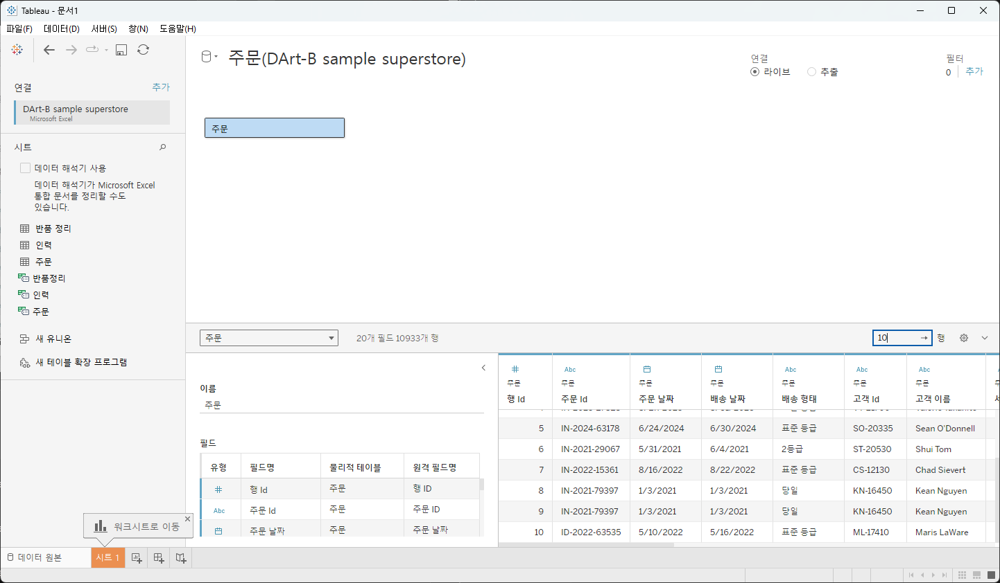

# w1

# First Study Week

- 1강: [태블로설치](about:blank#1%EA%B0%95-%ED%83%9C%EB%B8%94%EB%A1%9C%EC%84%A4%EC%B9%98)
- 2강: [데이터연결](about:blank#2%EA%B0%95-%EB%8D%B0%EC%9D%B4%ED%84%B0%EC%97%B0%EA%B2%B0)
- 3강: [데이터연결과 데이터유형](about:blank#3%EA%B0%95-%EB%8D%B0%EC%9D%B4%ED%84%B0%EC%97%B0%EA%B2%B0%EA%B3%BC-%EB%8D%B0%EC%9D%B4%ED%84%B0%EC%9C%A0%ED%98%95)
- 4강: [데이터결합과 관계](about:blank#4%EA%B0%95-%EB%8D%B0%EC%9D%B4%ED%84%B0%EA%B2%B0%ED%95%A9%EA%B3%BC-%EA%B4%80%EA%B3%84)
- 5강 : [데이터결합과 조인](about:blank#5-%EB%8D%B0%EC%9D%B4%ED%84%B0%EA%B2%B0%ED%95%A9%EA%B3%BC-%EC%A1%B0%EC%9D%B8)
- 6강: [데이터결합 혼합](about:blank#6%EA%B0%95-%EB%8D%B0%EC%9D%B4%ED%84%B0%EA%B2%B0%ED%95%A9-%ED%98%BC%ED%95%A9)
- 7강: [데이터결합과 유니온](about:blank#7%EA%B0%95-%EB%8D%B0%EC%9D%B4%ED%84%B0-%EA%B2%B0%ED%95%A9%EA%B3%BC-%EC%9C%A0%EB%8B%88%EC%98%A8)
- 8강: [라이브 및 추출](about:blank#8%EA%B0%95-%EB%9D%BC%EC%9D%B4%EB%B8%8C-%EB%B0%8F-%EC%B6%94%EC%B6%9C)
- 9강: [데이터형식](about:blank#9%EA%B0%95-%EB%8D%B0%EC%9D%B4%ED%84%B0%ED%98%95%EC%8B%9D)
- 문제1 : [문제1](about:blank#%EB%AC%B8%EC%A0%9C-1)
- 문제2 : [문제2](about:blank#%EB%AC%B8%EC%A0%9C-2)
- 참고자료 : [참고자료](about:blank#%EC%B0%B8%EA%B3%A0-%EC%9E%90%EB%A3%8C)

## Study Schedule

| 강의 범위 | 강의 이수 여부 | 링크 |
| --- | --- | --- |
| 1~9강 | ✅ | [링크](https://youtu.be/3ovkUe-TP1w?si=CRjj99Qm300unSWt) |
| 10~19강 | 🍽️ | [링크](https://www.youtube.com/watch?v=AXkaUrJs-Ko&list=PL87tgIIryGsa5vdz6MsaOEF8PK-YqK3fz&index=75) |
| 20~29강 | 🍽️ | [링크](https://www.youtube.com/watch?v=AXkaUrJs-Ko&list=PL87tgIIryGsa5vdz6MsaOEF8PK-YqK3fz&index=65) |
| 30~39강 | 🍽️ | [링크](https://www.youtube.com/watch?v=e6J0Ljd6h44&list=PL87tgIIryGsa5vdz6MsaOEF8PK-YqK3fz&index=55) |
| 40~49강 | 🍽️ | [링크](https://www.youtube.com/watch?v=AXkaUrJs-Ko&list=PL87tgIIryGsa5vdz6MsaOEF8PK-YqK3fz&index=45) |
| 50~59강 | 🍽️ | [링크](https://www.youtube.com/watch?v=AXkaUrJs-Ko&list=PL87tgIIryGsa5vdz6MsaOEF8PK-YqK3fz&index=35) |
| 60~69강 | 🍽️ | [링크](https://www.youtube.com/watch?v=AXkaUrJs-Ko&list=PL87tgIIryGsa5vdz6MsaOEF8PK-YqK3fz&index=25) |
| 70~79강 | 🍽️ | [링크](https://www.youtube.com/watch?v=AXkaUrJs-Ko&list=PL87tgIIryGsa5vdz6MsaOEF8PK-YqK3fz&index=15) |
| 80~89강 | 🍽️ | [링크](https://www.youtube.com/watch?v=AXkaUrJs-Ko&list=PL87tgIIryGsa5vdz6MsaOEF8PK-YqK3fz&index=5) |

## 1강. 태블로설치

## 2강. 태블로연결

> 🧞‍♀️ 데이터 해석기는 어떤 경우 사용하나요?
> 

```
데이터 해석기를 지원하는 커넥터에서 병합셀 / 메모 / 바닥글 / 빈 셀 등을 감지, 무시하여 데이터세트의 실제 필드 값을 식별

데이터 관리시 Tableau가 읽기 쉽도록 하기 위해
```

> 🧞‍♀️ 깃허브 assignment 폴더의 DArt-B Sample Store.xls 파일을 다운받고 시트 중 ‘주문’ 시트를 불러와주세요.
> 



## 3강. 데이터연결과 데이터 유형

> 🧞‍♀️ 라이브와 추출의 차이가 무엇인가요? 어떤 경우 사용하나요?
> 

```
라이브 - 데이터와 직접 연결, 원본 변화시 작업 내용에 바로 영향. 처리속도 및 성능이 민감

추출 - 인메모리 데이터 엔진. 대용량 복잡 데이터에 있어 원본 상태를 hyper 상태로 저장. 이를 작업하며 처리속도가 빠름. 새로고침통해 추출데이터 갱신

데이터 원본 크기 / 위치 / 온라인 상태 등 고려해 선택
```

## 4강. 데이터결합과 관계

> 🧞‍♀️ 어떤 경우에 관계를, 어떤 경우에 조인을 사용하나요?
> 

```
관계 : 결합하는 데이터간 유형이 동일
-> 각각의 테이블에서 같은 필드 값을 가지는 경우. 독립적으로 테이블 활용 가능
-> 조인의 데이터 중복/필터링 문제 방지
-> 권장

조인 : 제어 / 의도적 필터리 / 복제 

```

## 5강. 데이터결합과 조인

주문 중 ‘반품된’ 주문만을 가지고 분석을 진행하려고 합니다.

> 🧞‍♀️ 해당 목적 달성을 위해서 Sample store 데이터셋의 어떤 시트를 조인(혹은 릴레이션)해야 할까요? 조인키는 무엇인지, (inner, outer, left, right) 조인 유형은 무엇일지 논의해주세요.
> 

데이터를 조인한 데이터 원본 창의 캡쳐를 첨부해주세요.
몇 개의 주문이 반품되었다고 표시되나요?


3027개 반품

반품 정리의 고객ID 필드는 모두 반품한 고객이므로 주문 고객과 겹치는 record만 선택?

## 6강. 데이터결합 혼합

## 7강. 데이터 결합과 유니온

> 🧞‍♀️ 유니온을 사용하기 위한 전제 조건은 무엇인가요?
> 

유니온 :한 테이블의 행을 다른 테이블에 추가하여 결합하는 방식

→ 테이블 구조가 동일 (필드가 모두 일치)해야 가

## 8강. 라이브와 추출

> 🧞‍♀️ 라이브와 추출 방법의 차이가 무엇인가요? 어떤 경우에 추출을 사용하면 좋을까요?
> 

**참고자료 : 온프레미스 데이터란?**

기업이나 조직이 자체적으로 보유한 물리적 서버나 데이터 센터 내에서 직접 관리하는 데이터로, 조직 내의 하나 이상 서버에서 통제됩니다. 본 서버들은 기업의 데이터센터나 물리적 위치에 설치되어 있으며, 네트워크를 통해 해당 데이터에 접근하고 관리할 수 있습니다.

```sql
라이브 - 데이터와 직접 연결, 원본 변화시 작업 내용에 바로 영향. 처리속도 및 성능이 민감

추출 - 인메모리 데이터 엔진. 대용량 복잡 데이터에 있어 원본 상태를 hyper 상태로 저장. 이를 작업하며 처리속도가 빠름. 새로고침통해 추출데이터 갱신

데이터 원본 크기 / 위치 / 온라인 상태 등 고려해 선택
```

## 9강. 데이터형식

## 문제 1.

용웅이는 아래 사진과 같이 2024년 3월부터 7월까지의 지하철 승하차 이용객 데이터를 가지고 있습니다. 월별로 데이터셋이 나누어진 상태며, 용웅이는 해당 데이터셋 5개 모두를 한 번에 시각화하려 합니다. 필드 값(컬럼)의 이름, 데이터 유형, 개수는 모두 같습니다.


image

이때, ‘조인, 관계, 혼합, 유니온’ 중 본 목적에 적합한 결합 방법은 무엇인가요? 하나씩 드래그하지 않고, 와일드카드를 이용해 모든 데이터를 빠르게 결합해보세요.

- 각 월별로 데이터를 집계하여 한번에 시각화 하려고 하는 경우 → 혼합
- 모든 월별 데이터를 한번에 집게하여 시각화 하려고 하는 경우 → 유니온

## 문제 2.

상원이는 태블로를 사용하여 회사의 매출 데이터를 시각화하려고 합니다. 태블로에서는 데이터를 연결하는 두 가지 방식인 **라이브 연결과 추출 연결**이 있습니다. 두 방식 중 어떤 것을 사용할지 고민 중입니다.

다음의 일상생활 사례를 바탕으로, 어떤 상황에서 라이브 연결이 적합하고, 어떤 상황에서 추출 연결이 더 적합한지 설명하세요.

1. 사례 1: 실시간 주식 시세 확인
주식 거래를 하고 있는 수금의왕 상원이는 주식 시세가 매 순간 변동하는 실시간 데이터를 필요로 합니다. 이 데이터를 기반으로 빠르게 결정을 내려야 합니다.

```
라이브
```

1. 사례 2: 상원이는 저번 주 제주도로 여행을 갔었어요. 비행 중에 예산 계획을 세우려 하는데, 인터넷 연결이 불안정할 것 같아요. 여행 전 미리 예산 데이터를 다운로드해서 오프라인에서도 사용할 수 있으면 좋겠습니다.

```
추출
```

## 참고 자료

데이터 분석을 하다보면 지역별로 경향을 알아보고자 할 때가 많습니다.

태블로에서는 시/도, 시군구명을 칼럼으로 가지고 있고, 그걸 지리적 위치로 바꿔주면 지도에서 위치를 인식하는데요.
하지만 읍면동(행정동) 단위까지 인식하지는 못합니다.

그럼 어떻게 읍면동 단위까지 세분화하여 표기할 수 있을까요?

이때 방금 배운 데이터 릴레이션 혹은 조인을 사용합니다.
맵 그래프는 지금 배울 부분은 아니지만, 데이터 병합에 관련된 부분이기에 필요하신 분들을 위해 아래 링크를 걸어두겠습니다.


screen

바로 읍면동의 경계를 가지고 있는 shp, geojson 등 공간파일을 원본데이터와 머지하는 것입니다.

링크: https://subinze.tistory.com/m/2