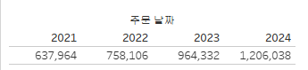

# w2

# Second Study Week

- 10강: [차원과 측정값](about:blank#10%EA%B0%95-%EC%B0%A8%EC%9B%90%EA%B3%BC-%EC%B8%A1%EC%A0%95%EA%B0%92)
- 11강: [시각화](about:blank#11%EA%B0%95-%EC%8B%9C%EA%B0%81%ED%99%94)
- 12강: [막대그래프](about:blank#12%EA%B0%95-%EB%A7%89%EB%8C%80%EA%B7%B8%EB%9E%98%ED%94%84)
- 13강: [누적막대그래프](about:blank#13%EA%B0%95-%EB%88%84%EC%A0%81%EB%A7%89%EB%8C%80%EA%B7%B8%EB%9E%98%ED%94%84)
- 14강: [병렬막대그래프](about:blank#14%EA%B0%95-%EB%B3%91%EB%A0%AC%EB%A7%89%EB%8C%80%EA%B7%B8%EB%9E%98%ED%94%84)
- 15강: [누적병렬막대그래프](about:blank#15%EA%B0%95-%EB%88%84%EC%A0%81%EB%B3%91%EB%A0%AC%EB%A7%89%EB%8C%80%EA%B7%B8%EB%9E%98%ED%94%84)
- 16강: [라인그래프](about:blank#16%EA%B0%95-%EB%9D%BC%EC%9D%B8%EA%B7%B8%EB%9E%98%ED%94%84)
- 17강: [맵작성](about:blank#17%EA%B0%95-%EB%A7%B5%EC%9E%91%EC%84%B1)
- 18강: [텍스트테이블](about:blank#18%EA%B0%95-%ED%85%8D%EC%8A%A4%ED%8A%B8%ED%85%8C%EC%9D%B4%EB%B8%94)
- 19강: [트리맵과 하이라이트테이블](about:blank#19%EA%B0%95-%ED%8A%B8%EB%A6%AC%EB%A7%B5%EA%B3%BC-%ED%95%98%EC%9D%B4%EB%9D%BC%EC%9D%B4%ED%8A%B8%ED%85%8C%EC%9D%B4%EB%B8%94)
- 문제1 : [문제1](about:blank#%EB%AC%B8%EC%A0%9C1)
- 문제2 : [문제2](about:blank#%EB%AC%B8%EC%A0%9C2)
- 참고자료 : [참고자료](about:blank#%EC%B0%B8%EA%B3%A0-%EC%9E%90%EB%A3%8C)

## Study Schedule

| 강의 범위 | 강의 이수 여부 | 링크 |
| --- | --- | --- |
| 1~9강 | ✅ | [링크](https://youtu.be/3ovkUe-TP1w?si=CRjj99Qm300unSWt) |
| 10~19강 | ✅ | [링크](https://www.youtube.com/watch?v=AXkaUrJs-Ko&list=PL87tgIIryGsa5vdz6MsaOEF8PK-YqK3fz&index=75) |
| 20~29강 | 🍽️ | [링크](https://www.youtube.com/watch?v=AXkaUrJs-Ko&list=PL87tgIIryGsa5vdz6MsaOEF8PK-YqK3fz&index=65) |
| 30~39강 | 🍽️ | [링크](https://www.youtube.com/watch?v=e6J0Ljd6h44&list=PL87tgIIryGsa5vdz6MsaOEF8PK-YqK3fz&index=55) |
| 40~49강 | 🍽️ | [링크](https://www.youtube.com/watch?v=AXkaUrJs-Ko&list=PL87tgIIryGsa5vdz6MsaOEF8PK-YqK3fz&index=45) |
| 50~59강 | 🍽️ | [링크](https://www.youtube.com/watch?v=AXkaUrJs-Ko&list=PL87tgIIryGsa5vdz6MsaOEF8PK-YqK3fz&index=35) |
| 60~69강 | 🍽️ | [링크](https://www.youtube.com/watch?v=AXkaUrJs-Ko&list=PL87tgIIryGsa5vdz6MsaOEF8PK-YqK3fz&index=25) |
| 70~79강 | 🍽️ | [링크](https://www.youtube.com/watch?v=AXkaUrJs-Ko&list=PL87tgIIryGsa5vdz6MsaOEF8PK-YqK3fz&index=15) |
| 80~89강 | 🍽️ | [링크](https://www.youtube.com/watch?v=AXkaUrJs-Ko&list=PL87tgIIryGsa5vdz6MsaOEF8PK-YqK3fz&index=5) |

# Second Study Week

## 10강: 차원과 측정값

> 🧞‍♀️ 차원과 측정값의 고유한 특성에 대해 설명해주세요.
> 
- 차원 - 정성적인 값을 가지는 데이터; 불연속형
- 측정값 - 정량적인 값을 가지는 데이터; 연속형

*Quiz: 차원은 불연속형이고, 측정값은 연속형이다 (o, x)*

```
o
```

## 11강: 시각화



주문날짜 더블클 - 매출 더블


열에 주문날짜 행에 매출합

→ 표현방식 선택을 통해서 시각화 방법 바꿀수 있음

- 차원 : 독립적 값. 불연속형. 머리글 표시
- 측정값 : 연속형. 패널로 표시

*Quiz: 차원은 대부분 불연속형이며 표 형태로 시각화했을 때 머리글로 표시되고, 측정값은 대부분 연속형이므로 표 형태로 시각화 진행했을 때 패널로 추가된다.(o, x)*

```
o
```

## 12강: 막대그래프

- 정렬 - 자동 - 툴바에 오른내림차순 선택 / 수동 - 선택된 필 우클릭해서 수동 정렬
- 색상 표시하고 싶으면 색상 구분 기준 필드를 색상 마크에 드래그
- 범례 정렬은 범례 우클릭해서 정렬
- 색상 마크 눌러서 수동 색 선택 가능
- 그래프에 수치를 표기하고 싶으면 해당 필드 레이블에 드래그
- 마크 취소는 필드 밖으로 빼기

## 13강: 누적막대그래프

- 세분화하고자하는 (누적 기준이 되는) 필드를 세부정보로 드래그 → 누적 막대 그래프 표현
- 카테고리별 년도 매출 백분율 → 합계 필드 - 퀵테이블 계산 - 구성비율
- Ctrl 누르고 드래그하면 복사


## 14강: 병렬막대그래프

- 날짜는 기본적으로 불연속형
    
    → 병렬 그래프 그릴때 필드를 연속형으로 해야 각 막대의 수평위치 고정해서 그룹을 형성
    
    → 불연속 - 1월 년 구분 못함 / 연속형 - 시간 흐름 구분 가능
    
- 데이터 유형 변경은 표시하려는 뷰에서 하는 것이 권징
- 마우스 우클릭상태로 드래그하면 필드 놓기 설정 가


그라데이션

> 🧞‍♀️ 끊어진 색상으로 배치되어 표현되는 경우와 이어지는 그라데이션 색으로 표현되는 경우 두 가지가 있습니다. 위 사진의 경우 왜 색깔이 끊어지는 색상으로 표시되지 않고 그라데이션으로 표시되었나요? 데이터의 특성과 관련하여 이야기해 봅시다.
> 

```
월 단위로 필드를 지정했는데, 월 날짜 필드를 연속형으로 두었기 때문이
```

## 15강: 누적병렬막대그래프

- 이중 축 : 두가제 데이터를 하나의 축을 사용해 표현하는 방식
- 


screen

> 🧞‍♀️ 위 사진에서는 Profit과 Sales를 측정값으로 두었습니다. 개별 칼럼(태블로에서는 #필드라 명칭합니다)을 열/행에 두는 대신, ’측정값’을 사용하고 측정값 선반에 필드를 올려둡니다. 이런 방식을 사용하는 이유가 무엇일지, 어떻게 사용할 수 있을지 고민해보세요
> 

```
측정값끼리의 집계/계산에 활용한다..?
```

## 16강: 라인그래프

- 열에 날짜 필드 있으면 자동으로 라인그래프로 변환
- 이중 축에서 축 두개의 scaling을 맞춰주기 위해서는 축 우클릭 → 축 동기화


## 17강: 맵작성

```jsx
## 참고
Country/Region - 나라/지역
State/Province - 시/도
City - 시
County - 군
Postal Code - 우편번호
Area Code - 지역 코드
Airport - 공항
MSA/CBSA (Metropolitan Statistical Area) - 광역 통계 지역
Longitude - 경도
Latitude - 위도
```

- 경도위도 좌표 데이터 있으면 태블로의 지리적 역할을 통해 간단히 맵 그릴 수 있음 → 텍스트 만으로 지도를 표현 가능
- 지도에 필드를 나타냈는데 지역이 표시되지 않는 경우 맵-위치편집에서 해당 지역들이 포함되도록 위치를 확인
- 맵에 여러개의 지리적 계층을 활용하는 경우 마크 계층 사용
    
    각 계층은 고유 마크와 캡션 색상을 가짐
    


## 18강: 텍스트테이블

## 19강: 트리맵과 하이라이트테이블

- 트리맵 - 범주 → 레이블 / 수량(매출) → 색상& 크기
- 상위 n개 필터링 : 필드 → 필터 - 상위 - 필드 기준 - 기준이 될 필드 선택


- 하이라이트 테이블 : 색상이 입혀진 특수 테이블
    
    범주형 데이터를 색상으로 비교, 텍스트 테이블의 여러 다양한 데이터 나타내야 할 때 효과적
    
- 범주별로 그라데이션 없ㅇ 단일 색상을 표현하고 싶은 경우 - 사용자 지정 색상에서 단계별로

> 🧞‍♀️하이라이트 테이블 등에서 두개 이상의 측정값을 사용하는 경우, 함께 색을 표현하게 되면 단위가 달라 정확한 값을 표현할 수 없습니다. 이때 클릭해야 하는 항목은?
> 

```
마크 - 색상 필드 - 별도의 범례사용
```

## 문제1

```jsx
지민이는 superstore의 한국 수출 관리 업무를 맡고 있습니다. 국가/지역이 우리나라, 즉 'South Korea'인 데이터만을 필터링하여, 상품 하위범주 별로 각 하위범주가 매출의 비율 중 얼마만큼을 차지하는지를 트리맵으로 확인하고 싶습니다. 트리맵의 각 네모 안에 표시되는 텍스트에는 **해당 범주의 이름과 전체에서 해당 범주가 차지하는 비율**이 표시되었으면 합니다.지민이를 도와주세요! (풀이를 찾아가는 과정을 기술해주세요)
```

```
1. 매출 -> 색상 & 크기
2. 하위 범주 -> 텍스트 레이블
3. 국가지역 -> 필터 -> 대한민국 선택
4. 매출 -> 레이블 -> 우클릭에서 퀵테이블 계산 -> 구성 비율
```


## 문제2

```jsx
주현이는 국가/지역별로 매출과 수익의 증감을 시간에 흐름에 따라 표현하고자 합니다. 특히 **한국/중국/일본**을 비교하고자 해당 3국을 남기고 필터링했고, 3개 국가를 매출과 수익이라는 두 가지 지표로 확인해보았습니다.아래는 위 설명을 표현해본 예시입니다.
```


스크린샷

```jsx
레퍼런스와 꼭 같지 않아도 자유롭게 표현하고, 그 과정을 기술해주세요.
```

```
1. 국가/지역 -> 열 & 국기/지역 필터링 (China, Japan, Korea)
2. 주문날짜(월) -> 열. 우클릭 후 연속형으로 변환
3. 매출& 수익 -> 행. 우클릭 후 이중축
4. 두번쨰 축 - 축 동기화 해서 스케일링
```


### 참고 자료

```jsx
테이블 계산에서 '다음을 사용하여 계산'에는 테이블 당 계산과 패널 당 계산이 있습니다. 이에 대해 이해하는 것이 꼭 필요하기 때문에, 외부 레퍼런스를 참고하여 이 단계에서 꼭! 학습 후, 넘어가주세요 :)
```


테이블계산

[참고 외부자료 링크는여기를클릭하십시다](https://velog.io/@eunsuh/Tableau-%EB%A0%88%EB%B2%A8UP-%EA%B0%95%EC%9D%98-%EC%A0%95%EB%A6%AC-1-%ED%85%8C%EC%9D%B4%EB%B8%94-%EA%B3%84%EC%82%B0)