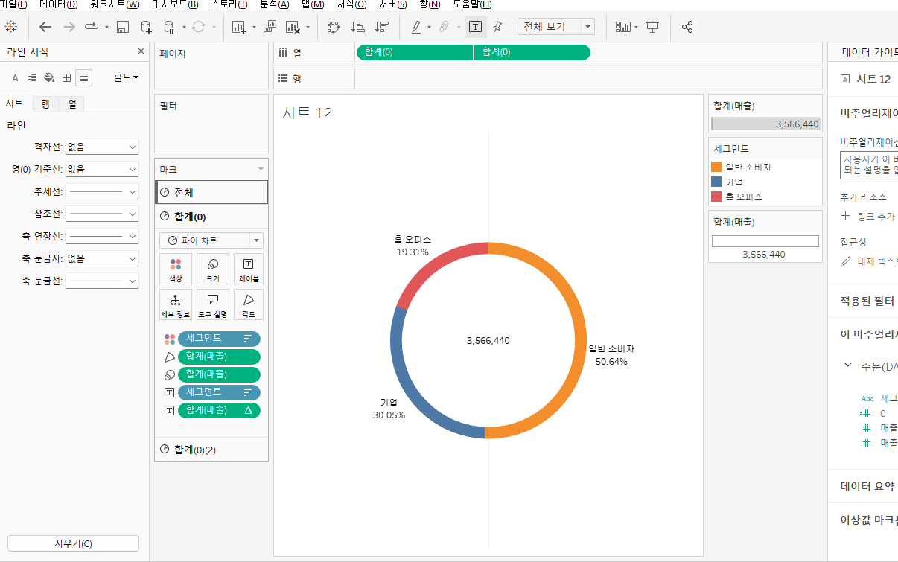

# w3_MD

# Third Study Week

- 20강: [파이와 도넛차트](about:blank#20%EA%B0%95-%ED%8C%8C%EC%9D%B4%EC%99%80-%EB%8F%84%EB%84%9B%EC%B0%A8%ED%8A%B8)
- 21강: [워드와 버블차트](about:blank#21%EA%B0%95-%EC%9B%8C%EB%93%9C%EC%99%80-%EB%B2%84%EB%B8%94%EC%B0%A8%ED%8A%B8)
- 22강: [이중축과 결합축](about:blank#22%EA%B0%95-%EC%9D%B4%EC%A4%91%EC%B6%95%EA%B3%BC-%EA%B2%B0%ED%95%A9%EC%B6%95)
- 23강: [분산형 차트](about:blank#23%EA%B0%95-%EB%B6%84%EC%82%B0%ED%98%95-%EC%B0%A8%ED%8A%B8)
- 24강: [히스토그램](about:blank#24%EA%B0%95-%ED%9E%88%EC%8A%A4%ED%86%A0%EA%B7%B8%EB%9E%A8)
- 25강: [박스플롯](about:blank#25%EA%B0%95-%EB%B0%95%EC%8A%A4%ED%94%8C%EB%A1%AF)
- 26강: [영역차트](about:blank#26%EA%B0%95-%EC%98%81%EC%97%AD%EC%B0%A8%ED%8A%B8)
- 27강: [간트차트](about:blank#27%EA%B0%95-%EA%B0%84%ED%8A%B8%EC%B0%A8%ED%8A%B8)
- 28강: [필터](about:blank#28%EA%B0%95-%ED%95%84%ED%84%B0)
- 29강: [그룹](about:blank#29%EA%B0%95-%EA%B7%B8%EB%A3%B9)
- 문제1 : [문제1](about:blank#%EB%AC%B8%EC%A0%9C1)
- 문제2 : [문제2](about:blank#%EB%AC%B8%EC%A0%9C2)
- 참고자료 : [참고자료](about:blank#%EC%B0%B8%EA%B3%A0-%EC%9E%90%EB%A3%8C)

## Study Schedule

| 강의 범위 | 강의 이수 여부 | 링크 |
| --- | --- | --- |
| 1~9강 | ✅ | [링크](https://youtu.be/3ovkUe-TP1w?si=CRjj99Qm300unSWt) |
| 10~19강 | ✅ | [링크](https://www.youtube.com/watch?v=AXkaUrJs-Ko&list=PL87tgIIryGsa5vdz6MsaOEF8PK-YqK3fz&index=75) |
| 20~29강 | ✅ | [링크](https://www.youtube.com/watch?v=Qcl4l6p-gHM) |
| 30~39강 | 🍽️ | [링크](https://www.youtube.com/watch?v=e6J0Ljd6h44&list=PL87tgIIryGsa5vdz6MsaOEF8PK-YqK3fz&index=55) |
| 40~49강 | 🍽️ | [링크](https://www.youtube.com/watch?v=AXkaUrJs-Ko&list=PL87tgIIryGsa5vdz6MsaOEF8PK-YqK3fz&index=45) |
| 50~59강 | 🍽️ | [링크](https://www.youtube.com/watch?v=AXkaUrJs-Ko&list=PL87tgIIryGsa5vdz6MsaOEF8PK-YqK3fz&index=35) |
| 60~69강 | 🍽️ | [링크](https://www.youtube.com/watch?v=AXkaUrJs-Ko&list=PL87tgIIryGsa5vdz6MsaOEF8PK-YqK3fz&index=25) |
| 70~79강 | 🍽️ | [링크](https://www.youtube.com/watch?v=AXkaUrJs-Ko&list=PL87tgIIryGsa5vdz6MsaOEF8PK-YqK3fz&index=15) |
| 80~89강 | 🍽️ | [링크](https://www.youtube.com/watch?v=AXkaUrJs-Ko&list=PL87tgIIryGsa5vdz6MsaOEF8PK-YqK3fz&index=5) |

# Third Study Week

## 20강: 파이와 도넛차트

### 도넛차트 만들기

파이차트 생성 - 필드 두개 생성 - 총합 레이블 차트 생성 - 이중 축 설정하여 병합 - 시트 우클릭 서식에서 구분선 / 머리글 표을 없음으로 전환



## 21강: 워드클라우와 버블차트

버블차트 : 수치적 데이터를 원의 크기로 표시


워드클라우드 : 단어 빈도수를 텍스트로 표현

- 지역 우클릭 드래그 → 크기 → 카운트 선택
- 지역 → 레이블
- 마크 → 텍스트로 변경
- 매출 → 색상


## 22강: 이중축과 결합축

이중축 : 마크를 각각의 축에 개별적으로 적용 가능


결합 축 : 하나의 축을 공유
: 결합할 필드를 기존 필드 축으로 드래그 → 결합 된 것 중 가장 큰 범위의 축을 공유

측정값 필드에 새로운 측정값 추가 가능


## 23강: 분산형 차트

: 파라미터 간의 상관관계 파악

매출 - 수익 그래프 생성 한뒤 제조업체 → 세부정보 드랍
추세선을 많이 활용 : 분석 탭 → 추세선 선형에 드랍 → 범주별로 추세선 그려짐

추세선 편집에서 요소에서 범주 체크 해제하면 모든 데이터 대한 추세선 확인 가능


## 24강: 히스토그램

: 분포 형태를 표시 - 연속형 측정값을 그룹화

구간차원 생성 : 매출 우클릭 - 만들기 - 구간차원

만들어진 구간차원 → 열

매출 → 행 → 카운트


## 25강: 박스플롯

지역 및 고객 세그먼트 별 매출을 표시하는 박스 플롯


## 26강: 영역차트

: 라인-축 사이 공간이 색상으로 채워진 라인 차트 → 연속형 데이터의 누계를 표현


## 27강: 간트차트

: 시간 경과에 따른 기간 시각화


## 28강: 필터

필터 실행 순서

1. 추출 필터 
    
    원본 데이터 연결 추출- 편집에서 필터 생성 가능
    
2. 데이터 원본 필터
    
    작업 위한 데이터 중 일부만 워크스페이스에 불러오는 경우
    
3. 컨텍스트 필터
    
    다른 필터가 컨텍스트에 종속됨
    
    필터 우클릭 - 컨텍스트에 추가 → 
    
4. 차원 필터 
    - 일반
    - 와일드카드
    - 조건
    - 상

## 29강: 그룹

: 수동으로 필드 항목을 묶으며 원본에 없는 사용자 지정 그룹 필드 제작 가능

1. 뷰에서그룹 생성 
2. 항목별로 묶을 필드를 선택


## 문제 1.

```jsx
유정이는 superstore 데이터셋에서 '주문' 테이블을 보고 있습니다.1) 국가/지역 - 시/도- 도시 의 계층을 생성했습니다. 계층 이름은 '위치'로 설정하겠습니다.2) 날짜의 데이터 타입을 '날짜'로 바꾸었습니다.코로나 시기의 도시별 매출 top10을 확인하고자
1) 배송 날짜가 코로나시기인 2021년, 2022년에 해당하는 데이터를 필터링했고
2) 위치 계층을 행으로 설정해 펼쳐두었습니다.이때, 수익의 합계가 TOP 10인 도시들만을 보았습니다.
```


image-2.png

```
겉보기에는 전체 10개로, 잘 나온 결과처럼 보입니다. 그러나 유정이는 치명적인 실수를 저질렀습니다.
오늘 배운 '컨텍스트 필터'의 내용을 고려하여 올바른 풀이 및 결과를 구해주세요
```


년(배송 날짜)를 컨텍스트 필터로 지정해주어야, 2021-2022년의 데이터로 필터링을 우선 적용 한 뒤 그 다음 상위 10개를 필터링하게 됨

## 문제 2.

```jsx
태영이는 관심이 있는 제품사들이 있습니다. '제품 이름' 필드에서 '삼성'으로 시작하는 제품들을 'Samsung group'으로, 'Apple'으로 시작하는 제품들을 'Apple group'으로, 'Canon'으로 시작하는 제품들을 'Canon group'으로, 'HP'로 시작하는 제품들을 'HP group', 'Logitech'으로 시작하는 제품들을 'Logitech group'으로 그룹화해서 보려고 합니다. 나머지는 기타로 설정해주세요. 이 그룹화를 명명하는 필드는 'Product Name Group'으로 설정해주세요.(이때, 드래그보다는 멤버 찾기 > 시작 문자 설정하여 모두 찾아 한번에 그룹화해 확인해보세요.)
```


group


```jsx
해당 그룹별로 어떤 국가/지역이 주문을 많이 차지하는지를 보고자 합니다. 매출액보다는 주문량을 보고 싶으므로, 주문Id의 카운트로 계산하겠습니다.기타를 제외하고 지정한 5개의 그룹 하위 목들만을 이용해 아래와 같이 지역별 누적 막대그래프를 그려봐주세요.
```


image

