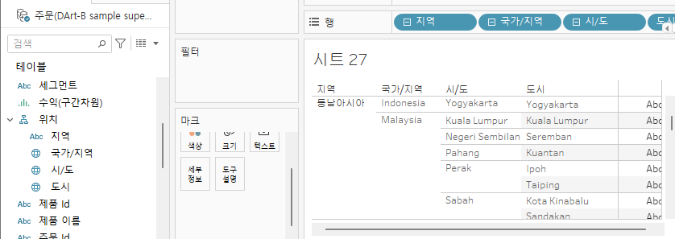

# w4

# Fourth Study Week

- 30강: [계층](about:blank#30-%EA%B3%84%EC%B8%B5)
- 31강: [집합](about:blank#31-%EC%A7%91%ED%95%A9)
- 32강: [결합집합](about:blank#32-%EA%B2%B0%ED%95%A9%EC%A7%91%ED%95%A9)
- 33강: [계산된 필드](about:blank#33-%EA%B3%84%EC%82%B0%EB%90%9C-%ED%95%84%EB%93%9C)
- 34강: [행수준계산](about:blank#34-%ED%96%89%EC%88%98%EC%A4%80%EA%B3%84%EC%82%B0)
- 35강: [집계계산](about:blank#35-%EC%A7%91%EA%B3%84%EA%B3%84%EC%82%B0)
- 36강: [테이블계산](about:blank#36-%ED%85%8C%EC%9D%B4%EB%B8%94%EA%B3%84%EC%82%B0)
- 37강: [퀵테이블계산(1)](about:blank#37-%ED%80%B5%ED%85%8C%EC%9D%B4%EB%B8%94%EA%B3%84%EC%82%B01)
- 38강: [퀵테이블계산(2)](about:blank#38-%ED%80%B5%ED%85%8C%EC%9D%B4%EB%B8%94%EA%B3%84%EC%82%B02)
- [문제1](about:blank#%EB%AC%B8%EC%A0%9C-1)
- [문제2](about:blank#%EB%AC%B8%EC%A0%9C-2)
- [문제3](about:blank#%EB%AC%B8%EC%A0%9C-3)

## Study Schedule

| 강의 범위 | 강의 이수 여부 | 링크 |
| --- | --- | --- |
| 1~9강 | ✅ | [링크](https://www.youtube.com/watch?v=AXkaUrJs-Ko&list=PL87tgIIryGsa5vdz6MsaOEF8PK-YqK3fz&index=84) |
| 10~19강 | ✅ | [링크](https://www.youtube.com/watch?v=AXkaUrJs-Ko&list=PL87tgIIryGsa5vdz6MsaOEF8PK-YqK3fz&index=75) |
| 20~29강 | ✅ | [링크](https://www.youtube.com/watch?v=AXkaUrJs-Ko&list=PL87tgIIryGsa5vdz6MsaOEF8PK-YqK3fz&index=65) |
| 30~38강 | ✅ | [링크](https://youtu.be/e6J0Ljd6h44?si=nhGbB7GsdOCqj15f) |
| 39~49강 | 🍽️ | [링크](https://www.youtube.com/watch?v=AXkaUrJs-Ko&list=PL87tgIIryGsa5vdz6MsaOEF8PK-YqK3fz&index=45) |
| 50~59강 | 🍽️ | [링크](https://www.youtube.com/watch?v=AXkaUrJs-Ko&list=PL87tgIIryGsa5vdz6MsaOEF8PK-YqK3fz&index=35) |
| 60~69강 | 🍽️ | [링크](https://www.youtube.com/watch?v=AXkaUrJs-Ko&list=PL87tgIIryGsa5vdz6MsaOEF8PK-YqK3fz&index=25) |
| 70~79강 | 🍽️ | [링크](https://www.youtube.com/watch?v=AXkaUrJs-Ko&list=PL87tgIIryGsa5vdz6MsaOEF8PK-YqK3fz&index=15) |
| 80~89강 | 🍽️ | [링크](https://www.youtube.com/watch?v=AXkaUrJs-Ko&list=PL87tgIIryGsa5vdz6MsaOEF8PK-YqK3fz&index=5) |

> 🧞‍♀️ 오늘의 스터디는 지니와 함께합니다.
> 

## 30. 계층

: 데이터 Drill Down해 값을 세부적으로 보고자 하는경우 사용

ex) 날짜 데이터와 함께 제공되는 경우 자동으로 게층이 생성

주어진 데이터는 위치로 게층화되어있지 않아 계층화해줌



## 31. 집합

: 사용자가 조건을 설정해 그를 기반으로 데이터 구분하는 방식

eX) 수익낸 상위 10개 도시 (Filter 말고)

시/도 필드 → 우클릭-만들기-집합 → 필터처럼 상위 10개 


## 32. 결합집합

집합 1 : 시/도 → 집합만들기 → 조건) 매출 50k이상

집합2 : 시/도 → 집합만들기 → 조건) 수익 10k 이상

집합 필드 하나 클릭해서 결합집합 만들기 → 다양한 join 조건 선택


→ 두 집합 조건 만족하는 경우

## 33. 계산된 필드

: 기존 데이터 이외에 계산해야 할 데이터가 추가로 필요한 경우

1. 데이터 패널 통해 생성
2. 분석탭 활용 생성
3. 필드 우클릭해서 생성

드롭다운 메뉴에서 함수 목록 확인

필드 입력

- 필드 드래그드랍
- 필드 이름 입력 []

주석 //


## 34. 행수준계산

계산된 필드

- 기본계산
    
    : 데이터 원본에 대한 행 수준 계산 / 집계 계산
    
    - 행 수준 계산 : 데이터 각 레코드
    - 집계계산 : 현재 뷰 기준


## 35. 집계계산

기본설정 집계 계산 변경 : 필드 우클릭 - 기본속성 집계 변경

계산된 필드 변경 : 드랍다운에서 집계 함수 선택

사용자가 집계 계산 필드를 만들면 해당 필드에 집계가 나타나고 방식 변경 불가


## 36. 테이블계산

: 뷰에 보이는 내용 바탕


**테이블 계산 방향 설정하기**

1. 올라간 필드 우클릭 - 다음을 사용하여 계산
2. 올라간 필드 우클릭 - 테이블 게산 편집

전월차이와 계산


## 37. 퀵테이블계산(1)

필드 우클릭 - 퀵테이블 계산

- 누계
    
    
    
- 연도별 매출 **차이**
    
    
    
- 비율 차이
    
    
    
- 구성 비율
    
    
    
- 백분위
    
    
    

## 38. 퀵테이블계산(2)

- 이동 평균
    
    
    
- YTD; Year to Date : 특정 시점 기준으로 해당 연도부터 시점가지 총계
    
    누계와 같은 계념이지만 하위 필드 분기/월이 있어야 사용 가능
    
    
    
- Compound Growth Rate
    
    
    
- 전년대비 성장률
    
    
    
- YTD 성장률
    
    
    

## 문제 1.

규석이는 이제껏 매출을 올리는 데에 힘썼었지만, 왠지 모르게 주머니에 들어오는 돈이 없어 속상합니다.

그래서 매출이 상위 20곳에 속하지만, 수익률(%)이 마이너스인 시/도를 확인하려고 합니다.

> 수익률은 SUM([수익]) / SUM([매출])로 정의합니다.
> 

어떤 집합을 만들었고, 어떤 결합을 하였는지를 중심으로 기술하고, 결과 자료를 첨부해주세요.

(텍스트 표 형태이며, 색상으로 위 집합을 구분할 수 있게 만들어주세요.)


예시이미지

1. 상위 20 집합 / 수익률 <0인 집합 2개 만든 후 교집합된 결합집합 생성
    
    
    
2. 시/도 → 행, 매출합계 텍스트에 마크. 결합집합 → 색상마크로 표현하여 표현
    
    
    

## 문제 2.

선희는 주문 Id별로 주문에서 배송까지에 걸리는 날짜 일수가 궁금했습니다.
그래서 주문 ID별로 주문에서 배송까지 걸리는 일자를 ‘배송까지 걸린 일수’라는 계산된 필드로 만들고, 이를 마크에 올린 후 확인해보았습니다.
이때, 계산된 필드의 식은 ’DATEDIFF’ 함수를 이용하였습니다.

배송까지 걸린 일수 계산을 위한 DATEDIFF 함수 수식을 적어주세요.

```
DATEDIFF('day', [주문 날짜], [배송 날짜])
```


datediff

그런데 위 그림처럼 ’주문 날짜’와 ’배송 날짜’를 함께 행에 올려 확인해보니, 주문날짜와 배송날짜의 차이가 ’배송까지 걸린 일수’와 다릅니다.

ID-2021-11126을 보니, 11월 26일 배송에 11월 30일 배송이면 4일 차이인데, 12일이 걸렸다고 하네요. 왜 이런 문제가 생긴걸까요?

```
어떠한 주문 ID는 여러개의 제품 레코드를 가지고 있어 배송일을 계산한 결과를 여러개 제품 레코드에 있어 합계해버리기 때문
```

그리고 이를 해결하기 위해서는 어떻게 해야 할까요?

```
주문처리일수 필드를 측정값 -> 차원 
```

## 문제 3.

다음은 Tableau의 다양한 계산을 사용할 수 있는 경우를 빈칸으로 두고 문제를 작성한 것입니다. 각 빈칸에 적합한 계산 유형을 채워보세요.

보기
> **누계, 차이, 비율 차이, 구성 비율, 순위, 백분위수, 이동 평균, YTD 총계, 통합 성장률, 전년 대비 성장률, YTD 성장률**

| 계산 유형 | 설명 | 사용 예시 |
| --- | --- | --- |
| **누계** | 데이터의 누적 합계를 계산 | 한 기업이 월별 매출 데이터를 누적하여 연간 매출 추이를 보고 싶을 때 사용 |
| **차이** | 연속 데이터 포인트 간의 차이를 계산 | 한 기업이 월별 매출 데이터에서 전월 대비 매출 증감량을 분석하고 싶은 경우 |
| **비율 차이** | 연속 데이터 포인트 간의 비율 변화를 계산 | 한 기업이 월별 매출 데이터에서 전월 대비 매출 증감률(%)을 분석하고 싶은 경우 |
| **구성 비율** | 전체에서 각 데이터 포인트의 비율을 계산 | 한 기업이 전체 매출에서 각 제품군이 차지하는 비율을 보고 싶을 때 사용 |
| **순위** | 데이터의 순위를 매깁니다 | 한 기업이 제품별 매출 데이터를 순위별로 정렬하여 상위 10개 제품을 분석하고 싶은 경우 |
| **백분위수** | 데이터의 백분위를 계산 | 한 기업이 고객별 구매 금액 데이터를 백분위수로 나누어 상위 25% 고객을 분석하고 싶은 경우 |
| **이동 평균** | 일정 기간의 평균을 계산 | 한 기업이 주간 매출 데이터에서 4주 이동 평균을 계산하여 트렌드를 분석하고 싶은 경우 |
| **YTD 총계** | 연초부터 현재까지의 총계를 계산 | 한 기업이 월별 매출 데이터를 연초부터 현재까지 누적하여 연간 매출 목표 달성 여부를 분석하고 싶은 경우 |
| **통합 성장률** | 일정 기간 동안의 연평균 성장률을 계산 | 한 기업이 5년 간 매출 데이터를 바탕으로 연평균 성장률(CAGR)을 계산하고 싶은 경우 |
| **전년 대비 성장률** | 전년 동기간 대비 성장률을 계산 | 한 기업이 월별 매출 데이터에서 전년 동월 대비 매출 성장률을 분석하고 싶은 경우 |
| **YTD 성장률** | 연초부터 현재까지의 성장률을 계산 | 한 기업이 올해 연초부터 현재까지의 매출이 전년 동기 대비 얼마나 성장했는지 분석하고 싶은 경우 |

> 사용 예시를 참고하여 실제 경우처럼 생각하며 고민해보아요!
>