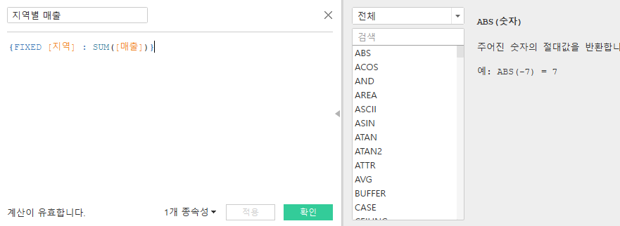

# w5

# Fifth Study Week

- 38강: [퀵테이블계산(2)](about:blank#38-%ED%80%B5%ED%85%8C%EC%9D%B4%EB%B8%94%EA%B3%84%EC%82%B02)
- 39강: [LOD](about:blank#39%EA%B0%95-lod)
- 40강: [EXCLUDE](about:blank#40-lod-exclude)
- 41강: [INCLUDE](about:blank#41-lod-include)
- 42강 : [매개변수](about:blank#42-%EB%A7%A4%EA%B0%9C%EB%B3%80%EC%88%98)
- (43강이 없어 패스합니다)
- 44강: [매개변수 실습](about:blank#44-%EB%A7%A4%EA%B0%9C%EB%B3%80%EC%88%98-%EC%8B%A4%EC%8A%B5)
- 45강: [마크카드](about:blank#45-%EC%9B%8C%ED%81%AC%EC%8B%9C%ED%8A%B8-%EB%A7%88%ED%81%AC%EC%B9%B4%EB%93%9C)
- 46강: [서식계층](about:blank#46-%EC%84%9C%EC%8B%9D-%EA%B3%84%EC%B8%B5)
- 47강: [워크시트](about:blank#47-%EC%9B%8C%ED%81%AC%EC%8B%9C%ED%8A%B8-%EC%84%9C%EC%8B%9D)
- [문제1](about:blank#%EB%AC%B8%EC%A0%9C-1)
- [문제2](about:blank#%EB%AC%B8%EC%A0%9C-2)
- [문제3](about:blank#%EB%AC%B8%EC%A0%9C-3)

## Study Schedule

| 강의 범위 | 강의 이수 여부 | 링크 |
| --- | --- | --- |
| 1~9강 | ✅ | [링크](https://www.youtube.com/watch?v=AXkaUrJs-Ko&list=PL87tgIIryGsa5vdz6MsaOEF8PK-YqK3fz&index=84) |
| 10~19강 | ✅ | [링크](https://www.youtube.com/watch?v=AXkaUrJs-Ko&list=PL87tgIIryGsa5vdz6MsaOEF8PK-YqK3fz&index=75) |
| 20~29강 | ✅ | [링크](https://www.youtube.com/watch?v=AXkaUrJs-Ko&list=PL87tgIIryGsa5vdz6MsaOEF8PK-YqK3fz&index=65) |
| 30~39강 | ✅ | [링크](https://www.youtube.com/watch?v=e6J0Ljd6h44&list=PL87tgIIryGsa5vdz6MsaOEF8PK-YqK3fz&index=55) |
| 40~49강 | 🍽️ | [링크](https://www.youtube.com/watch?v=AXkaUrJs-Ko&list=PL87tgIIryGsa5vdz6MsaOEF8PK-YqK3fz&index=45) |
| 50~59강 | 🍽️ | [링크](https://www.youtube.com/watch?v=AXkaUrJs-Ko&list=PL87tgIIryGsa5vdz6MsaOEF8PK-YqK3fz&index=35) |
| 60~69강 | 🍽️ | [링크](https://www.youtube.com/watch?v=AXkaUrJs-Ko&list=PL87tgIIryGsa5vdz6MsaOEF8PK-YqK3fz&index=25) |
| 70~79강 | 🍽️ | [링크](https://www.youtube.com/watch?v=AXkaUrJs-Ko&list=PL87tgIIryGsa5vdz6MsaOEF8PK-YqK3fz&index=15) |
| 80~89강 | 🍽️ | [링크](https://www.youtube.com/watch?v=AXkaUrJs-Ko&list=PL87tgIIryGsa5vdz6MsaOEF8PK-YqK3fz&index=5) |

> 🧞‍♀️ 오늘의 스터디는 지니와 함께합니다.
> 

## 38. 퀵테이블계산(2)

- 이동 평균
    
    
    
- YTD; Year to Date : 특정 시점 기준으로 해당 연도부터 시점가지 총계
    
    누계와 같은 계념이지만 하위 필드 분기/월이 있어야 사용 가능
    
    
    
- Compound Growth Rate
    
    
    
- 전년대비 성장률
    
    
    
- YTD 성장률
    
    
    

## 39강. LOD

LOD : 현재 뷰에 영향을 받지 않고 원하는 세부 수준에서 계산 수행 - 

→ 표현식 INCLUDE/EXCLUDE/FIXED

FIXED : 현재 뷰에 있는 차원과 상관없이 계산된 필드에서 우너하는 차원 따라 계산

1. FIXED에서 설정한 차원이 뷰에 포함된 경우
    
    
    
    
    
2. = 포함 안된 경우
    
    
    
    
    
- 퀵테이블로 구성비율 나타내기
    
    
    

## 40. LOD EXCLUDE


> 🧞‍♀️ FIXED와 EXCLUDE을 사용하는 경우의 차이가 무엇인가요?
> 

```
FIXED : **현재 뷰에 있는 차원과 상관없이** 계산된 필드에서 원하는 차원 따라 계산
EXCLUDE : **현재 뷰에서** 특정 차원을 제외하여 계산

-> 하위 범주 세분화 시 FIXED는 변경되지 않으나 EXCLUDE는 바뀜. 
-> FIXED는 필터에 값 영향받지 않지만 EX는 뷰의 차원을 따라 계산하므로 필터로 관현 차원을 수정하면 영향받
```

> 🧞‍♀️ 왜 ATTR 함수를 사용하나요?
> 


```
단일 기준을 두고 그를 중싱으로 대소를 보여주기 위해서
```


## 41. LOD INCLUDE

: 현재 뷰에서 특정 차원을 추가하여 계산 - 차원 필터에 영향받음


→ 각 도시의 고객당 평균 매출을 표시하나 따로 필드 생성안했으므로 재사용하기 위해 INCLUDE LOD 사용


: 주문 ID 차원을 포함하여 합계한 매출에 평균을 반환


위와 동일한 계산을 위해서 
FIXED의 경우: `AVG({FIXED [주문 Id] : SUM([매출])})`


> 🧞‍♀️ 그렇다면 어떤 경우에 각 표현식을 사용하나요? 예시와 함께 적어보아요
> 

```
뷰에 표시되는 값이 차원 -> FIXED LOD
: FIXED는 차원&측정갑 반환, INCLUDE/EXCLUDE는 측정값만 반환

반환값이 차원필터의 영향을 받게되는 경우 -> INCLUDE/EXCLUDE
```

## 42. 매개변수

: 고정값이 아닌 동적값으로 변경하기 위해 사용하는 기능

매개변수 사용 w/ 계산식, 필터, 참조


→ 바로 상위5개 값 보고싶다면? → 매개변수를 활용해 보다 쉽게 상위 n값 변경 가능

1. 필터
    - 필터 → 값 입력에서 매개변수 만들기
    - 필드 → 만들기 → 매개변
    - 데이터 패널
        
        
        
        하위범주 필드 → 집합만들기 → 상위 필드 기준으로 선택 → 해당 집합 색상으로 표시 가능
        
        
        

## 44. 매개변수 실습

분석탭 → 참조선 드래그 → 매개변수 생성해서 확인


- 표 달성한/달성 못한 구분?
    
    
    
    
    
- 시작/마지막 날짜 선택해 해당 날짜 범위 매출 합계
    
    시작/마지막 날짜 매개변수 생성 → 분석 택 참조 구간 시작과 끝에 배정 → 매개변수 표시하
    
    
    

## 45. 워크시트 마크카드


## 46. 서식 계층

상위 보다 아래에서 설정한 서식이 우선 적용

- 서식 : 글꼴
    - **시트**
        
        서식패널의 시트탭에 현재 워크 시트 서식을 설정
        
    - **행**
        
        
        

**특정 필드 서식**

→ 필드 우클릭  / 필드 드롭다운


**서식모두 지우고 싶은 경우:**

서식 → 워크시트 서식 지우기

> 🧞‍♀️ 서식계층을 일반적인 것에서 구체적인 것 순서로 기입해보세요
> 

```
(일반적)
- 워크시트 서식
- 행/열 서식
- 특정 필드 
- 필드 레이블
- 도구설명/제목/마크
(세부적)
```

## 47. 워크시트 서식

- 글꼴
    
    
    
- 맞춤
    
    
    
- 음영
    
    
    

## 문제 리스트

### 문제 1.

다음은 Tableau의 다양한 계산을 사용할 수 있는 경우를 빈칸으로 두고 문제를 작성한 것입니다. 각 빈칸에 적합한 계산 유형을 채워보세요.

보기
> **누계, 차이, 비율 차이, 구성 비율, 순위, 백분위수, 이동 평균, YTD 총계, 통합 성장률, 전년 대비 성장률, YTD 성장률**

| 계산 유형 | 설명 | 사용 예시 |
| --- | --- | --- |
| 누계 | 데이터의 누적 합계를 계산 | 한 기업이 월별 매출 데이터를 누적하여 연간 매출 추이를 보고 싶을 때 사용 |
| 차이 | 연속 데이터 포인트 간의 차이를 계산 | 한 기업이 월별 매출 데이터에서 전월 대비 매출 증감량을 분석하고 싶은 경우 |
| 비율 차이 | 연속 데이터 포인트 간의 비율 변화를 계산 | 한 기업이 월별 매출 데이터에서 전월 대비 매출 증감률(%)을 분석하고 싶은 경우 |
| 구성 비율 | 전체에서 각 데이터 포인트의 비율을 계산 | 한 기업이 전체 매출에서 각 제품군이 차지하는 비율을 보고 싶을 때 사용 |
| 순위 | 데이터의 순위를 매깁니다 | 한 기업이 제품별 매출 데이터를 순위별로 정렬하여 상위 10개 제품을 분석하고 싶은 경우 |
| 백분위수 | 데이터의 백분위를 계산 | 한 기업이 고객별 구매 금액 데이터를 백분위수로 나누어 상위 25% 고객을 분석하고 싶은 경우 |
| 이동 평균 | 일정 기간의 평균을 계산 | 한 기업이 주간 매출 데이터에서 4주 이동 평균을 계산하여 트렌드를 분석하고 싶은 경우 |
| YTD 총계 | 연초부터 현재까지의 총계를 계산 | 한 기업이 월별 매출 데이터를 연초부터 현재까지 누적하여 연간 매출 목표 달성 여부를 분석하고 싶은 경우 |
| 통합 성장률 | 일정 기간 동안의 연평균 성장률을 계산 | 한 기업이 5년 간 매출 데이터를 바탕으로 연평균 성장률(CAGR)을 계산하고 싶은 경우 |
| 전년 대비 성장률 | 전년 동기간 대비 성장률을 계산 | 한 기업이 월별 매출 데이터에서 전년 동월 대비 매출 성장률을 분석하고 싶은 경우 |
| YTD 성장률 | 연초부터 현재까지의 성장률을 계산 | 한 기업이 올해 연초부터 현재까지의 매출이 전년 동기 대비 얼마나 성장했는지 분석하고 싶은 경우 |

> 사용 예시를 참고하여 실제 경우처럼 생각하며 고민해보아요 :)
> 

## 문제 2.

```
가장 많이 주문한 사람들은 물건 배송을 빨리 받았을까요?
조건을 준수하여 아래 이미지를 만들어봆시다.
1) 국가/지역별(이하 '나라'로 통칭), 범주별로 배송일자가 다를 수 있으니 먼저, 나라별/범주별로 평균 배송일자를 설정한 뒤,
2) 각 나라에서 가장 많이 주문한 사람의 이름을 첫 번째 열,
3) 그 사람이 주문한 제품 이름을 2번째 열,
4) 각 상품이 배송까지 걸린 날 수를 표현하고
5) 그리고 만약 배송이 각 나라/범주별 평균보다 빨랐다면 '빠름', 같다면 '평균', 느리다면 '느림' 으로 print 해주세요.
```


## 문제 3.

```
채원이는 태블로를 쓰실 수 없는 상사분께 보고하기 위한 대시보드를 만들고 싶어요.

제품 중분류별로 구분하되 매개변수로써 수익, 매출, 수량을 입력하면 저절로 각각 지표에 해당하는 그래프로 바뀌도록 설계하고자 해요.

어떤 값이 각 지표의 평균보다 낮은 값을 갖고 있다면 색깔을 주황색으로, 그것보다 높다면 파란색으로 표시하고 싶어요. 그 평균값은 각 지표별로 달라야 해요.
```

