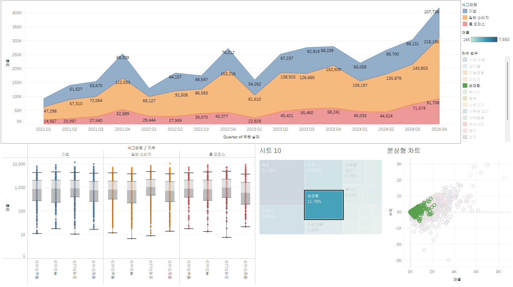

# w6

연도-분기별 매출 변화와 함꼐, 세그먼트별 점유를 표현하기 위해 누적 분포를 활용하였습니다.

또한 세그먼트별 매출의 시간적 변화 뿐 아니라 지역별로 box plot을 통해 비교할 수 있습니다.

세그먼트 및 하위 범주의 경우는 트리맵을 통해, 선택할 수 있도록 하였으며, 이는 분상형 차트와 연계해 동작합니다. 해당 분상형 차트에서는 선택한 하위 범주의 매출 대비 수익성을 빠르게 확인할 수 있습니다.

이를 통해 사용자는 거시적인 시간-지역별 매출 흐름을 파악할 수 있으며, 더 세분화된 범주 하에서는 상세한 수익성 분석이 가능합니다.