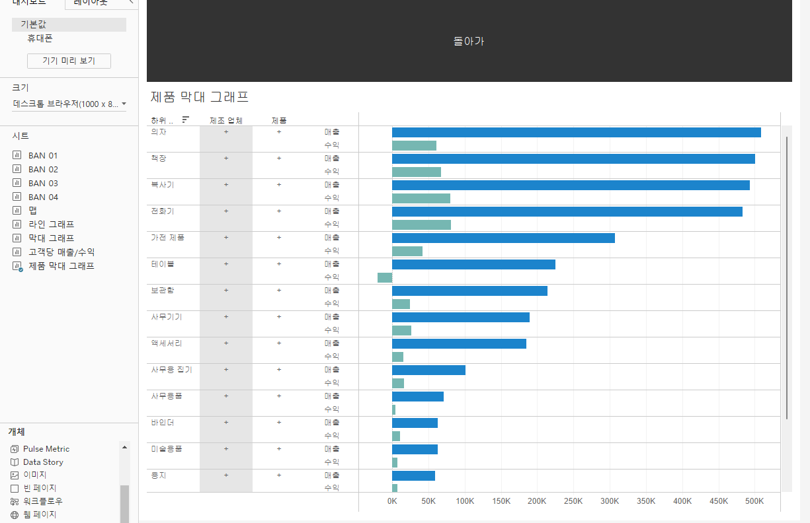

# 7th_TIL_template

# 7th Study Week

## Study Schedule

| 회차 | 강의 범위 | 강의 이수 여부 | 링크 |
| --- | --- | --- | --- |
| 1 | 1~7강 | ✅ | [링크](https://www.youtube.com/watch?v=AXkaUrJs-Ko&list=PL87tgIIryGsa5vdz6MsaOEF8PK-YqK3fz&index=84) |
| 2 | 8~17강 | ✅ | [링크](https://www.youtube.com/watch?v=AXkaUrJs-Ko&list=PL87tgIIryGsa5vdz6MsaOEF8PK-YqK3fz&index=75) |
| 3 | 18~27강 | ✅ | [링크](https://www.youtube.com/watch?v=AXkaUrJs-Ko&list=PL87tgIIryGsa5vdz6MsaOEF8PK-YqK3fz&index=65) |
| 4 | 28~37강 | ✅ | [링크](https://www.youtube.com/watch?v=e6J0Ljd6h44&list=PL87tgIIryGsa5vdz6MsaOEF8PK-YqK3fz&index=55) |
| 5 | 38~47강 | ✅ | [링크](https://www.youtube.com/watch?v=AXkaUrJs-Ko&list=PL87tgIIryGsa5vdz6MsaOEF8PK-YqK3fz&index=45) |
| 6 | 48~57강 | ✅ | [링크](https://www.youtube.com/watch?v=AXkaUrJs-Ko&list=PL87tgIIryGsa5vdz6MsaOEF8PK-YqK3fz&index=35) |
| 7 | 58~66강 | ✅ | [링크](https://www.youtube.com/watch?v=AXkaUrJs-Ko&list=PL87tgIIryGsa5vdz6MsaOEF8PK-YqK3fz&index=25) |
| 8 | 67~77강 | 🍽️ | [링크](https://www.youtube.com/watch?v=AXkaUrJs-Ko&list=PL87tgIIryGsa5vdz6MsaOEF8PK-YqK3fz&index=15) |
| 9 | 78~85강 | 🍽️ | [링크](https://www.youtube.com/watch?v=AXkaUrJs-Ko&list=PL87tgIIryGsa5vdz6MsaOEF8PK-YqK3fz&index=5) |

---

> 🧞‍♀️ 오늘은 강의보다 실습과 대시보드 직접 만들기가 더 중요하니, 기록보다는 사고하며 강의를 들어주세요.직접 실습파일을 다운로드하는 번거로움이 있어 assignment > 7th_files에 실습파일을 올려두었습니다. 활용해주세요!
> 

## 58. 집합값 변경

## 59강. 스토리패널

## 60. 스토리

## 61. 대시보드 탐색

## 62. 태블로 단추

## 63. 막대그래프 드릴다운

## 64. 트리맵 드릴다운

## 65. 파이 차트 드릴다운

## 66. 지도 드릴다운

---

## 문제

오늘은 별도의 문제가 없습니다.

다만, 학술제 이후 마지막 과제(11/27~)로서 한 주 동안에는 학술제 주제 관련 데이터(없을 경우, 본인 관심 데이터)를 사용해 나만의 대시보드를 제작할 예정입니다. 또한, 학술제에서 시각화 시 태블로를 사용하기를 권장하는 안내가 나갈 예정입니다.
그 때 열심히 배운 내용을 잘 활용해주세요. 감사합니다 :)